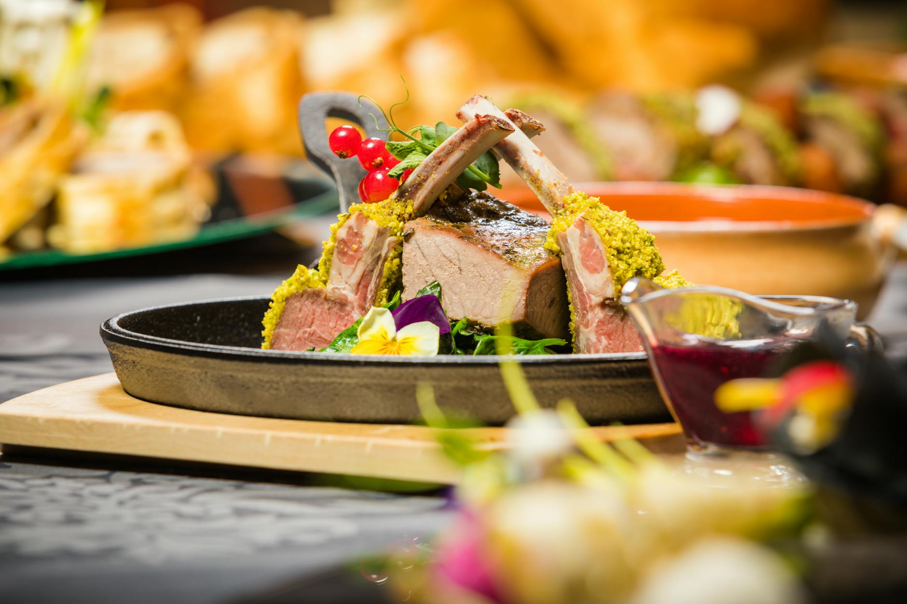

# Breast of Lamb with Mustard and Herb Crust

*Breast of lamb, cut from the belly, is an economical yet deeply flavorful cut. When properly trimmed, boned, and gently braised, it transforms into an elegant dish worthy of fine dining. The herb crust adds texture and focuses the flavors of the cooking broth.*

**Serves:** 4

## Overview
This composed dish showcases lamb breast's rich potential: the trimmed meat is braised until tender in an herb-infused stock, then sliced and topped with a crispy herb and mustard breadcrumb crust. The braising liquid becomes an elegant sauce thickened with cream and sharpened with mustard, providing a sophisticated accompaniment that complements both the meat and crust.

## Ingredients

### Lamb & Braising Liquid
- 4 portions of lamb breast (rolled and tied)
- 2 tablespoons lamb fat or cooking oil
- 50 grams unsalted butter
- 1 garlic clove (crushed)
- 1 sprig fresh thyme
- 1 sprig fresh rosemary
- 2 sage leaves
- 1 onion (diced)
- 2 carrots (diced)
- 2 celery sticks (diced)
- Half leek (diced)
- 1.2 litres chicken stock
- Lamb bones (optional, for extra flavor)
- Salt and freshly ground black pepper

### Herb Crust
- 6 slices white bread
- 25 grams butter
- 2 shallots (finely chopped)
- 1 teaspoon chopped mixed thyme, sage, and rosemary
- 2 teaspoons Dijon or grain mustard
- Salt and freshly ground black pepper

### Finishing Sauce
- 150 ml double cream
- 2 teaspoons Dijon or grain mustard

## Method

### Stage 1 – Prepare Herb Crust
1. Remove and discard bread crusts; cut bread into quarters.
2. Place bread in a food processor and process until fine crumbs form.
3. Melt 25 grams butter with the finely chopped shallots and bring to a simmer.
4. Remove from heat and allow to cool slightly.
5. Gradually spoon the shallot butter into the breadcrumbs, mixing constantly.
6. The mixture is ready when it holds together when pressed but remains free-flowing.
7. Add chopped mixed herbs and flavor with 2 teaspoons mustard. Set aside.

### Stage 2 – Braise Lamb
1. Heat a frying pan and sear the lamb breasts in fat or oil until browned on both sides.
2. Melt butter in a braising pan and slowly fry the garlic, herbs, and diced vegetables for a few minutes.
3. Add stock and lamb bones (if using) and bring to a simmer.
4. Add the seared lamb breasts and simmer gently until very tender, about 2 hours.
5. Remove the braising pan from heat and let the lamb cool slightly in the liquid.

### Stage 3 – Crust & Finish
1. Remove cooked lamb from the braising liquid and cut into 1 cm slices, separating into individual portions.
2. Push the slices together at a slight angle to recreate the original shape of each portion.
3. Top each portion with the herb crust.
4. Place under a hot grill until the crust is golden brown and crispy, about 3-4 minutes.

### Stage 4 – Make Sauce
1. Strain the braising liquid through a fine sieve into a saucepan.
2. Reduce over medium heat to about 300 ml (about one-quarter of the original volume).
3. Add double cream and cook for 5-10 minutes, stirring gently.
4. Whisk in remaining 1-2 teaspoons mustard to taste.
5. Season with salt and pepper.
6. Pour sauce around the crusted lamb portions and serve.

## Notes
- **Lamb Breast Preparation:** Ensure the meat is properly skinned, boned, and excess fat trimmed. Ask your butcher to do this if needed.
- **Breadcrumb Texture:** The crust should be coarse enough to hold together but loose enough to remain light; over-mixing creates a dense coating.
- **Braising Time:** Low and slow cooking transforms the tough cut into silken, tender meat; do not rush this stage.
- **Crust Application:** Molding the breadcrumbs onto warm (not hot) meat ensures good adhesion before grilling.

## Variations
**Without Crust:** Serve the sliced lamb with the mustard cream sauce alone for a lighter presentation.
**Herb Variation:** Use fresh tarragon instead of sage for a more delicate, anise-like flavor.
**Gratin Topping:** Replace breadcrumb crust with Emmental cheese mixed with thyme for a richer variation.

## Serving
Serve with: Root vegetable purées, sautéed spinach, or creamed potatoes
Garnish with: Fresh sage leaves, tarragon sprigs, and whole grain mustard on the side

## Storage
- Best eaten immediately after assembly, though the uncrusted lamb keeps 3-4 days refrigerated
- The braising liquid and meat can be frozen separately up to 2 months (prepare crust fresh when reheating)
- Reheated lamb is best finished under the grill again to crisp the crust