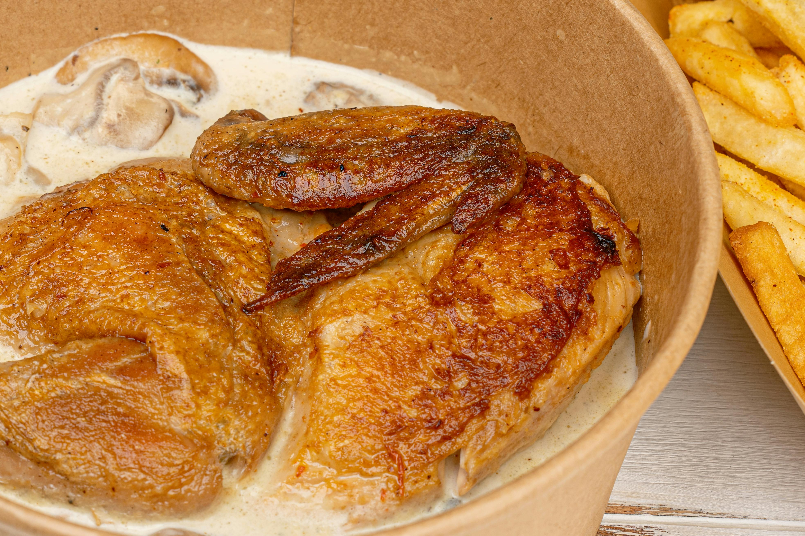

# Normandy Chicken

*This classic Norman dish pairs tender chicken with the region's signature ingredients: dry cider, apples, and rich crème fraîche. The result is a delicate, slightly sweet sauce that celebrates simplicity and regional tradition.*

**Serves:** 6-8

## Overview
Normandy Chicken showcases the bounty of France's northern apple region, combining succulent chicken legs braised in dry cider with caramelized apples, creamy crème fraîche, and aromatic tarragon. The sauce is silky-smooth without being heavy, balanced between the slight tartness of cider and the sweetness of apples, finished with a hint of Dijon mustard that adds complexity without overpowering.

## Ingredients

### Chicken & Base
- 6 chicken legs
- 40 grams butter
- 8 shallots (peeled)
- 3 sticks celery (chopped), plus leaves for garnish

### Braising Liquid
- 300 ml dry cider
- 300 ml chicken stock

### Finishing Components
- 2 apples (cored and cut into wedges)
- 2 teaspoons cornflour
- 5 tablespoons crème fraîche
- 2 tablespoons Dijon mustard
- 1 tablespoon chopped tarragon (plus whole leaves to serve)
- Salt and freshly ground black pepper to taste

## Method

### Stage 1 – Sear Chicken
1. Heat oven to 190°C.
2. Heat half of the butter in a large casserole dish on the hob over high heat.
3. Add chicken legs and cover. Cook on high heat for 10 minutes, turning as needed, until browned all over.
4. Season well with salt and pepper.

### Stage 2 – Braise in Cider
1. Add shallots and celery to the casserole and cook for a few minutes.
2. Pour in cider and chicken stock.
3. Bring to the boil, cover, and transfer to the oven.
4. Cook for 40 minutes until chicken is cooked through (juices run clear when pierced with a sharp knife).

### Stage 3 – Prepare Apples
1. While the chicken cooks, heat the remaining butter in a non-stick frying pan.
2. Add apple wedges and fry on both sides until lightly browned.
3. Set aside and keep warm.

### Stage 4 – Finish Sauce
1. Mix cornflour with 2 tablespoons crème fraîche to make a smooth paste.
2. Remove the cooked chicken from the casserole and keep warm.
3. Add the cornflour paste, remaining crème fraîche, mustard, and chopped tarragon to the casserole liquid on the hob.
4. Bring to a boil and simmer for 3 minutes, stirring gently, until thickened and smooth.
5. Taste and adjust seasoning with salt and pepper.
6. Return chicken to the casserole or arrange on a serving platter.
7. Spoon apple wedges and sauce over the chicken and garnish with fresh tarragon leaves and celery leaves.

## Notes
- **Cider Choice:** Use dry cider (not sweet); the slight tannin and acidity balance the cream and apples beautifully.
- **Apple Timing:** Cooking the apples separately prevents them from disintegrating in the sauce while ensuring they develop a caramelized exterior.
- **Cornflour Slurry:** Whisking cornflour with cream before adding prevents lumps and ensures a silky sauce.
- **Crème Fraîche Stability:** Stir gently after adding cream to avoid breaking the sauce; avoid vigorous boiling.

## Variations
**With Fresh Thyme:** Add 2 sprigs fresh thyme to the braising liquid for earthier flavor.
**Apple Cider Vinegar:** Add 1 teaspoon good apple cider vinegar at the end for extra tang.
**With Mushrooms:** Add 150g button mushrooms alongside the apples for textural variety.

## Serving
Serve with: Buttered egg noodles, creamed potatoes, or steamed leeks
Garnish with: Fresh tarragon leaves, celery leaves, and a light dusting of white pepper

## Storage
- Keeps 3-4 days refrigerated (sauce will thicken slightly as it cools)
- Freezes well up to 2 months (reheat gently and add a touch of cream if needed)
- Best eaten within 24 hours for optimal apple texture