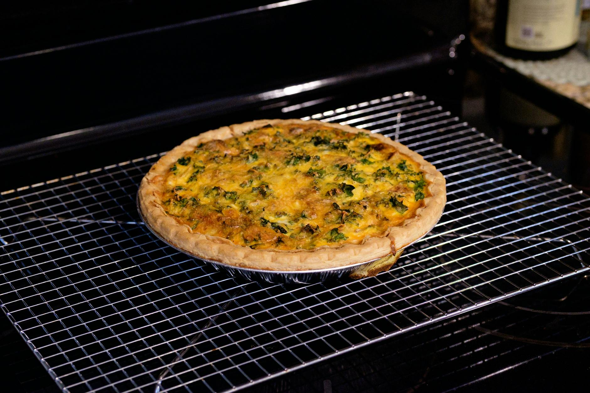

# Quiche Lorraine

*The original quiche: shortcrust shell, lardons, gruyère and a custard of cream, milk and eggs. Lorraine in northeast France didn't include cheese in the original; the modern recipe is the version most cooks use.*

**Serves:** 6-8

**Prep Time:** 30 minutes (plus 30 minutes resting pastry)

**Cook Time:** 50 minutes

## Overview
Buttery shortcrust pastry blind-baked first to set the base, then filled with rendered smoked lardons, grated gruyère and a rich egg-cream custard, baked at moderate heat until just set with a slight wobble in the centre.

## Ingredients

### Shortcrust
- 200 g plain flour
- 100 g cold unsalted butter (cubed)
- ½ teaspoon salt
- 1 large egg yolk
- 2-3 tablespoons ice-cold water

### Filling
- 200 g smoked bacon lardons
- 200 g gruyère cheese (grated)
- 4 large eggs
- 200 ml double cream
- 200 ml whole milk
- A grating of fresh nutmeg
- Salt and freshly ground black pepper

## Method

### Stage 1 – Make the pastry
1. Pulse the flour, salt and butter in a food processor until breadcrumb-textured.
1. Add the egg yolk and water; pulse until just coming together.
1. Tip onto a floured surface, bring together as a disc, wrap and refrigerate 30 minutes.

### Stage 2 – Line and blind-bake
1. Heat the oven to 180°C (160°C fan).
1. Roll the pastry to a 30 cm circle, 4 mm thick. Line a 23 cm tart tin, pressing into the corners; trim the edges leaving a 1 cm overhang.
1. Prick the base with a fork; line with parchment and fill with baking beans.
1. Blind-bake for 15 minutes; remove the beans and parchment, bake another 8-10 minutes until the base is pale gold and dry.
1. Trim the overhanging pastry flush with the tin.

### Stage 3 – Cook the lardons
1. Fry the lardons in a dry pan over medium heat for 5-6 minutes until crisp and the fat has rendered.
1. Drain on kitchen paper.

### Stage 4 – Custard
1. Whisk the eggs, cream and milk in a jug. Add a generous grating of nutmeg, salt and pepper.

### Stage 5 – Assemble and bake
1. Scatter the lardons evenly over the pastry base.
1. Sprinkle with the gruyère.
1. Pour in the custard slowly to avoid sloshing it over the edge.
1. Bake at 180°C (160°C fan) for 30-35 minutes until the custard is set with a slight wobble in the centre.
1. Cool 15 minutes before slicing.

## Notes
- **Blind-bake fully:** A par-baked base goes soggy under wet custard. Don't shortcut.
- **Don't overbake:** The custard should jiggle when nudged; it firms up as it cools. Set hard means scrambled.
- **Smoked lardons make it Lorraine:** Unsmoked bacon gives a different (still good) result.

## Serving
Serve with: A dressed green salad. Hot, warm or at room temperature.
Garnish with: A few chives or chervil leaves.

## Storage
- Keeps 3 days refrigerated.
- Reheats well at 160°C for 15 minutes (cover loosely with foil to stop the top colouring).
- Freezes 2 months.
