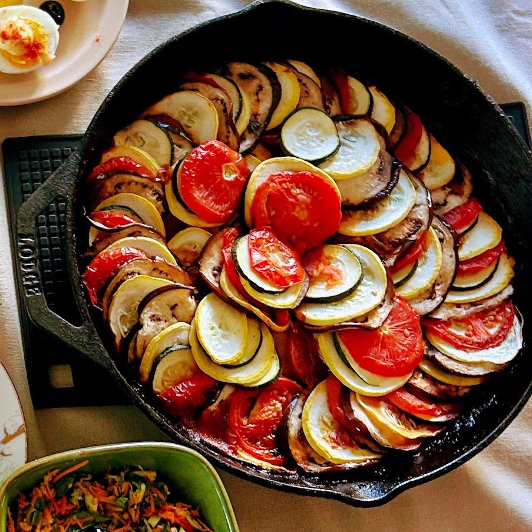

# Ratatouille

*Provençal stew of summer vegetables (aubergine, courgette, peppers, tomato) cooked separately and combined for proper integrity, not one undifferentiated mush. Works as a side, a sauce or a meal in itself with rice or crusty bread.*

**Serves:** 4-6

**Prep Time:** 25 minutes

**Cook Time:** 50 minutes

## Overview
Each vegetable browns in olive oil in batches so it keeps its texture; they meet in a pan with garlic, herbs and tomato to merge into a glossy stew. The slow-cooked tomato base provides the binder; the discrete vegetables provide the structure.

## Ingredients

- 1 large aubergine (cut into 2 cm cubes)
- 2 courgettes (cut into 2 cm cubes)
- 1 red pepper (seeded, cut into 2 cm pieces)
- 1 yellow pepper (seeded, cut into 2 cm pieces)
- 1 onion (chopped)
- 4 garlic cloves (sliced)
- 4 ripe tomatoes (skinned, deseeded, chopped) or 400 g tinned chopped tomatoes
- 1 tablespoon tomato purée
- 6 tablespoons olive oil (split through cooking)
- 2 sprigs fresh thyme
- 2 sprigs fresh rosemary
- 1 bay leaf
- A handful of fresh basil (torn, to finish)
- Salt and freshly ground black pepper

## Method

### Stage 1 – Salt the aubergine
1. Toss the aubergine cubes with 1 teaspoon of salt; let sit in a colander for 20 minutes.
1. Pat dry with kitchen paper.

### Stage 2 – Brown each vegetable
1. Heat 2 tablespoons of olive oil in a wide heavy pan over medium-high heat.
1. Brown the aubergine in batches, 5-6 minutes per batch, until golden but still holding shape. Set aside.
1. Brown the courgette in another tablespoon of oil for 4-5 minutes; set aside.
1. Brown the peppers for 6-7 minutes; set aside.

### Stage 3 – Build the base
1. Add the last 1-2 tablespoons of oil. Cook the onion over medium heat for 8 minutes until soft.
1. Add the garlic and cook 1 minute.
1. Stir in the tomato purée; cook 1 minute.
1. Add the chopped tomatoes, herbs, bay leaf and a generous pinch of salt. Simmer 10 minutes until thickened.

### Stage 4 – Combine
1. Return all the browned vegetables to the pan; stir gently to coat.
1. Cover and simmer on low heat for 15-20 minutes until the vegetables are tender but still distinguishable.
1. Discard the bay leaf and rosemary stems. Taste; season.
1. Tear basil over just before serving.

## Notes
- **Brown each vegetable separately:** Crowding the pan steams everything to mush. The discrete textures define ratatouille.
- **Salt the aubergine:** Pulls out bitter water and stops it sponging up oil. 20 minutes is enough.
- **Eat at room temperature:** Often better the next day, served barely warm with crusty bread or alongside grilled meat.

## Storage
- Improves overnight. Keeps 4 days refrigerated.
- Freezes 3 months.
