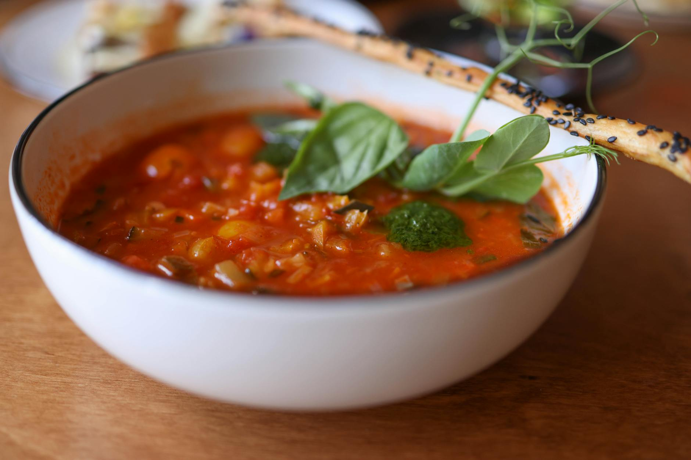

# Soupe au Pistou

*Provence's late-summer vegetable soup, finished at the table with a stir of fresh pistou — basil, garlic, olive oil and parmesan, pounded to a paste. Beans, courgettes, tomatoes, green beans simmer to tenderness in a clear broth; the pistou perfumes everything as it melts in. The smell of August in southern France.*

**Serves:** 6

**Prep Time:** 20 minutes

**Cook Time:** 50 minutes

## Overview
A vegetable soup of cannellini beans, kidney beans, courgette, green beans, tomatoes and small pasta in a herb-scented broth. Pistou — Provençal pesto without nuts — gets pounded fresh in a mortar. Ladled into bowls; a generous spoonful of pistou stirred in just before eating.

## Ingredients

### Soup
- 3 tablespoons olive oil
- 1 large onion (chopped)
- 2 leeks (sliced)
- 3 carrots (diced)
- 4 garlic cloves (crushed)
- 4 medium tomatoes (skinned and chopped) or 1 x 400 g tin chopped
- 1 bay leaf
- 1.5 litres vegetable stock
- 1 x 400 g tin cannellini beans (drained)
- 1 x 400 g tin red kidney beans (drained)
- 200 g green beans (cut in 3 cm)
- 2 medium courgettes (diced)
- 100 g small pasta (ditalini or small shells)
- Salt and black pepper

### Pistou
- 1 large bunch basil (around 80 g; leaves only)
- 4 garlic cloves
- 50 g parmesan (finely grated)
- 5 tablespoons olive oil
- ½ teaspoon salt

## Method

### Stage 1 – Vegetables
1. Heat the oil in a large pot over medium heat.
1. Cook the onion, leeks and carrots 8 minutes until soft.
1. Stir in the garlic; cook 1 minute.

### Stage 2 – Build the broth
1. Add the tomatoes, bay leaf and stock; season with salt and black pepper.
1. Bring to the boil; reduce to a simmer.
1. Cook 15 minutes.

### Stage 3 – Beans and remaining vegetables
1. Add the cannellini, kidney beans and green beans.
1. Simmer 10 minutes.
1. Add the courgettes and pasta; cook 8-10 minutes more until the pasta is just al dente and the courgettes are tender.

### Stage 4 – Pistou
1. While the soup finishes, pound the basil and garlic to a coarse paste in a mortar (or pulse in a small food processor).
1. Stir in the parmesan and olive oil and salt.

### Stage 5 – Serve
1. Discard the bay leaf.
1. Taste the soup; adjust salt and pepper.
1. Ladle into bowls; pass the pistou at the table.
1. Each diner stirs in a heaping spoonful as they eat.

## Notes
- **Pistou not pesto:** No pine nuts; no toasted seeds; just basil, garlic, oil and cheese. Lighter, more direct flavour.
- **Add the pistou off the heat:** Stirring it into the boiling pot kills the basil's freshness. Always at the table.
- **Bean substitutions:** Borlotti, butter beans, fresh shelled beans are all traditional. Use what's good; the variety is part of the dish.

## Storage
- Soup keeps 4 days refrigerated; freezes 3 months. Pistou is best fresh; refrigerated keeps 2 days.
