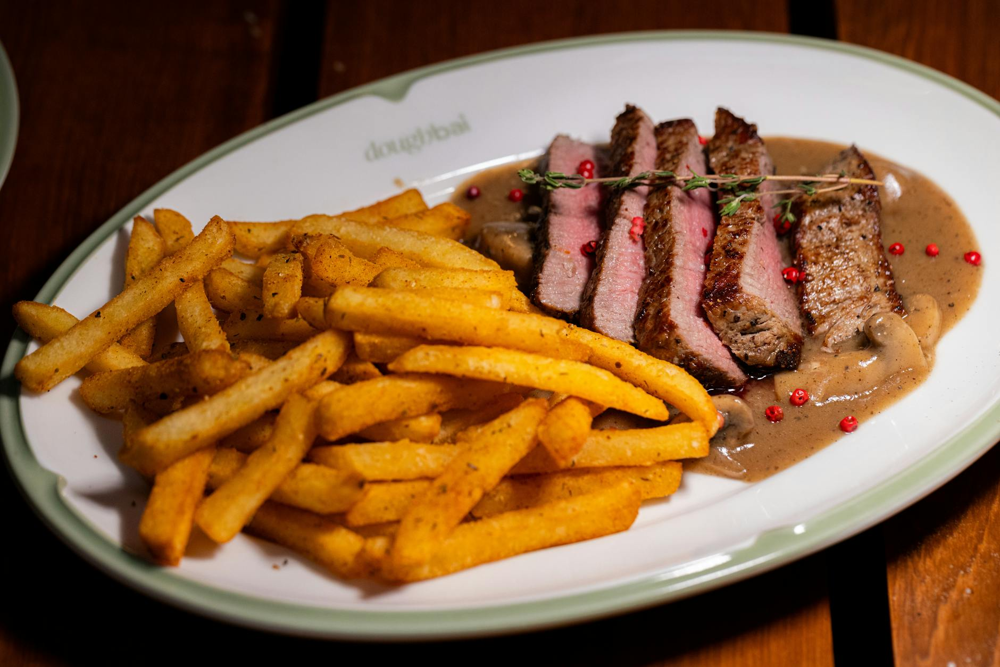

# Steak Frites with Béarnaise

*The bistro plate: a properly-rested rib-eye or sirloin, twice-fried golden chips, and a glossy béarnaise sauce on the side. Forty minutes of focused work; the closest a home cook gets to a bistro lunch.*

**Serves:** 2

**Prep Time:** 15 minutes

**Cook Time:** 25 minutes

## Overview
The frites take the longest (peel, cut, soak, fry low, drain, fry high) so start there. Béarnaise wants a clarified butter and a tarragon-vinegar reduction whisked into egg yolks. The steak is the easy part: hot pan, butter and thyme baste, rest hard.

## Ingredients

### Frites
- 600 g Maris Piper potatoes (peeled, cut into 1 cm thick batons)
- Vegetable oil or beef dripping for deep-frying
- Sea salt

### Steaks
- 2 rib-eye or sirloin steaks (about 250 g each, 2.5 cm thick)
- 1 tablespoon vegetable oil
- 30 g unsalted butter
- 2 thyme sprigs
- 1 garlic clove (smashed)
- Salt and freshly ground black pepper

### Béarnaise
- 4 tablespoons white wine vinegar
- 4 tablespoons dry white wine
- 1 shallot (finely chopped)
- 1 tablespoon fresh tarragon (chopped)
- 4 black peppercorns
- 3 large egg yolks
- 200 g unsalted butter (melted, kept warm)
- Salt
- An extra tablespoon of fresh tarragon (to finish)

## Method

### Stage 1 – Frites: first fry
1. Soak the cut chips in cold water for 10 minutes; drain and pat very dry.
1. Heat oil to 130°C. Fry chips in batches for 6-7 minutes until soft but pale.
1. Drain on a wire rack; let rest while you make the sauce and steak.

### Stage 2 – Béarnaise reduction
1. Combine vinegar, wine, shallot, tarragon and peppercorns in a small pan.
1. Reduce over medium heat to about 2 tablespoons; strain into a heatproof bowl. Cool slightly.

### Stage 3 – Cook the steak
1. Pat the steaks dry. Season generously with salt and pepper.
1. Heat oil in a heavy frying pan over high heat until smoking.
1. Add the steaks; sear 2 minutes a side for medium-rare (3 minutes for medium).
1. Lower heat slightly. Add the butter, garlic and thyme. Tilt the pan and baste the steaks with the foaming butter for 30 seconds.
1. Lift onto a board; rest at least 5 minutes (essential).

### Stage 4 – Finish the béarnaise
1. Add the egg yolks to the strained reduction. Whisk over a pan of barely-simmering water until thick and ribboning (4-5 minutes).
1. Drizzle in the warm melted butter slowly, whisking continuously, until the sauce is thick and glossy.
1. Stir in the remaining tarragon; season with salt.

### Stage 5 – Frites: second fry
1. Heat the oil to 190°C.
1. Fry the chips again in batches for 2-3 minutes until deep golden and crisp.
1. Drain, salt immediately.

### Stage 6 – Plate
1. Slice the steaks against the grain (or serve whole).
1. Pile chips alongside; a small jar or ramekin of béarnaise.

## Notes
- **Rest the steak:** Five minutes minimum. The juices need to redistribute or you get a wet plate and dry meat.
- **Béarnaise can split:** Keep the heat gentle; add butter slowly. If it splits, whisk in a teaspoon of cold water and try to bring it back.
- **Twice-fried chips:** Single fry gives raw centres or burnt edges. Two stages is non-negotiable.

## Storage
- Steak best hot from the rest. Eat cold sliced into a salad if leftovers; never reheats well.
- Béarnaise doesn't keep; eat the day it's made.
- Frites soften within an hour of frying.
