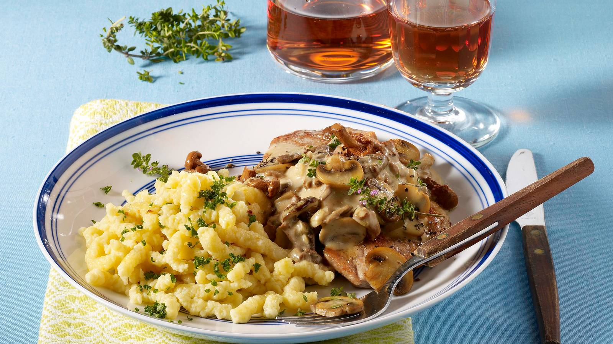

# Jägerschnitzel

*"Hunter's schnitzel": pork (sometimes veal) schnitzel served under a creamy mushroom-and-onion sauce. Less Austrian, more German; the dish you'd eat at a forest restaurant after a winter walk. The mushroom sauce makes it; everything else is foundation.*

**Serves:** 4

**Prep Time:** 20 minutes

**Cook Time:** 25 minutes

## Overview
Pork loin escalopes pound thin, bread, and shallow-fry. While they crisp, a sauce of bacon, onion, mushrooms, white wine, stock and cream reduces in another pan. The schnitzel plates with the sauce on top (or alongside, if you want the crumb to stay crisp), with spätzle or boiled potatoes underneath.

## Ingredients

### Schnitzel
- 4 pork loin escalopes (about 150 g each)
- 100 g plain flour
- 3 large eggs (beaten)
- 200 g fine breadcrumbs
- Salt and freshly ground black pepper
- 4 tablespoons vegetable oil + 30 g butter for shallow-frying

### Mushroom sauce
- 100 g smoked bacon lardons
- 1 tablespoon vegetable oil
- 1 small onion (finely chopped)
- 2 garlic cloves (crushed)
- 400 g mixed mushrooms (chestnut, oyster, etc.; sliced)
- 100 ml dry white wine
- 250 ml chicken stock
- 200 ml double cream
- 1 teaspoon Dijon mustard
- 1 teaspoon fresh thyme leaves
- A small bunch of flat-leaf parsley (chopped)
- Salt and freshly ground black pepper

### To serve
- Spätzle or boiled new potatoes

## Method

### Stage 1 – Sauce
1. Heat the oil in a wide heavy pan; cook the lardons until the fat renders and they're crisp.
1. Add the onion; cook 5 minutes.
1. Add the garlic and mushrooms; cook 6-7 minutes until any liquid has evaporated and the mushrooms are golden.
1. Pour in the wine; let it reduce by half.
1. Add the stock; reduce by half again.
1. Stir in the cream, mustard and thyme; simmer 3-4 minutes until thickened.
1. Season; keep warm.

### Stage 2 – Pound and bread
1. Bash each pork escalope to 5 mm thick between cling film.
1. Season with salt and pepper.
1. Set up flour, beaten egg, breadcrumbs.
1. Coat each escalope in flour, egg, then breadcrumbs.

### Stage 3 – Fry
1. Heat the oil and butter in a wide pan over medium-high heat.
1. Fry the schnitzels for 2-3 minutes a side until deep golden.
1. Drain briefly on a wire rack; salt.

### Stage 4 – Plate
1. Place each schnitzel on a warm plate over spätzle or potatoes.
1. Spoon the mushroom sauce over (or to the side, if keeping the crumb crisp matters).
1. Scatter parsley.

## Notes
- **Mixed mushrooms:** A monoculture of one type is fine; a blend (chestnut, oyster, shiitake) is better.
- **Don't oversauce:** A heavy sauce-blanket softens the crumb fast. Drizzle generously but leave some bare crumb visible.
- **Pork or veal:** Veal is the original; pork is the everyday version. Both work; pork tastes more like the German pub version.

## Storage
- Sauce keeps 3 days refrigerated, freezes 2 months.
- Schnitzel best fresh; reheat at 180°C for 6 minutes.
