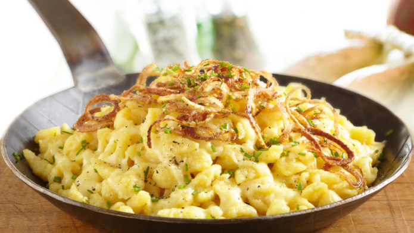

# Käsespätzle

*Swabian cheese spätzle: layers of fresh spätzle and grated emmental or gruyère, baked until the cheese melts into glossy strings and the top crisps. Topped with deeply caramelised onions. The Alpine answer to mac and cheese.*

**Serves:** 4-6

**Prep Time:** 30 minutes

**Cook Time:** 30 minutes

## Overview
Make spätzle as the base. Caramelise onions slowly in butter. Layer the spätzle with grated cheese (and a splash of cream) in a baking dish, top with the onions, and bake until bubbling. Serve with a green salad to cut through the richness.

## Ingredients

### Spätzle
- 1 batch fresh spätzle (see [spatzle.md](spatzle.md)), or 700 g cooked

### Onions
- 4 large onions (very thinly sliced)
- 50 g unsalted butter
- 1 teaspoon caster sugar
- ½ teaspoon salt

### Layered cheese
- 300 g emmental or gruyère (grated)
- 100 g mature cheddar (grated)
- 200 ml double cream
- A grating of fresh nutmeg
- Black pepper

### To finish
- A small bunch of chives (chopped)
- 30 g butter (for greasing the dish and dotting on top)

## Method

### Stage 1 – Caramelised onions
1. Melt the 50 g butter in a heavy pan over medium-low heat.
1. Add the onions, sugar and salt.
1. Cook for 25-30 minutes, stirring often, until deeply caramelised and crisping at the edges.

### Stage 2 – Spätzle
1. Make the spätzle if not already prepared; toss with a small knob of butter to prevent sticking.

### Stage 3 – Layer
1. Heat the oven to 180°C (160°C fan).
1. Butter a 25 x 20 cm baking dish.
1. Layer half the spätzle in the dish; sprinkle with half the cheese.
1. Repeat: the rest of the spätzle, the rest of the cheese.
1. Pour the cream evenly over; grate nutmeg on top; grind black pepper.
1. Dot with butter; cover with the caramelised onions.

### Stage 4 – Bake
1. Bake 20-25 minutes until the cheese is bubbling and the onions on top are dark.
1. Rest 5 minutes; scatter chives.

## Notes
- **Onions need 25 minutes:** This is the entire flavour boost. Pale onions = bland Käsespätzle.
- **Two cheeses:** Emmental gives the stretch; cheddar gives the savoury depth. All-emmental gives bland; all-cheddar gives gluey.
- **Green salad alongside:** This is rich. A vinaigrette-dressed bitter salad cuts through.

## Storage
- Keeps 3 days refrigerated; reheat at 180°C for 15 minutes.
- Freezes 2 months baked.
