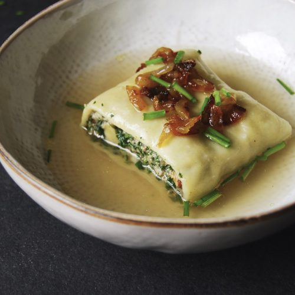

# Maultaschen

*Swabian "Lent dumplings": large, oblong filled pasta with a vegetarian filling of spinach, breadcrumbs, eggs and cheese. Tradition says they were invented by monks who hid meat from God during Lent — the vegetarian version is the older, more honest expression of the dish. Served two ways: in clear broth, or pan-fried with onions and a fried egg.*

**Makes:** 12-15 large maultaschen (serves 4)

**Prep Time:** 50 minutes

**Cook Time:** 30 minutes

## Overview
A simple egg-and-flour pasta dough rolls thin. The filling is spinach (frozen, thawed and squeezed dry), breadcrumbs soaked in milk, grated cheese, eggs, parsley and nutmeg. The dough rolls long; filling drops onto the bottom half; the top folds over and seals; the lot cuts into rectangles. Boiled briefly in vegetable broth or salted water; served in broth or pan-fried.

## Ingredients

### Dough
- 400 g plain flour (or "00" flour)
- 4 large eggs
- 1 teaspoon salt
- 2 tablespoons olive oil
- 4-6 tablespoons cold water

### Filling
- 100 g stale white bread (crusts off; torn into pieces)
- 200 ml whole milk
- 500 g frozen chopped spinach (thawed)
- 1 medium onion (finely chopped)
- 2 tablespoons unsalted butter
- 100 g gruyère or emmental (grated)
- 50 g parmesan (finely grated)
- 2 large eggs
- A grating of nutmeg
- A small bunch of parsley (chopped)
- Salt and black pepper

### To serve
- 1.5 litres vegetable stock (for in-broth)
- OR: 50 g butter + 1 large onion sliced (for pan-fried)
- 4 fried eggs (optional, with pan-fried)

## Method

### Stage 1 – Dough
1. Mound the flour on a board; make a well; add eggs, salt and olive oil.
1. Mix with a fork; bring together with hands; knead 10 minutes until smooth and elastic. Add water as needed if dry.
1. Wrap and rest 30 minutes.

### Stage 2 – Filling
1. Soak the bread in the milk for 10 minutes.
1. Squeeze the spinach hard to remove excess water; chop finely.
1. Cook the onion in the butter over medium heat 6 minutes until soft. Cool slightly.
1. Squeeze the bread dry; mash with a fork.
1. Combine the spinach, onion, bread, both cheeses, eggs, nutmeg, parsley, salt and black pepper. Mix thoroughly.

### Stage 3 – Roll and fill
1. Divide the dough in half. Roll one half on a floured surface to a rectangle about 30 x 60 cm and 2 mm thick.
1. Imagine the long rectangle divided horizontally in half.
1. Spoon heaped tablespoons of filling along the bottom half, spaced about 1 cm apart, leaving a 1 cm border at the bottom.
1. Brush around the filling with water.
1. Fold the top half over the filling; press around each mound to expel air; seal firmly.
1. Cut between mounds with a sharp knife or pasta wheel into rectangles roughly 8 x 12 cm.
1. Repeat with the second half of dough.

### Stage 4 – Cook
**For in-broth:**
1. Bring the stock to a gentle simmer (not a hard boil — too aggressive splits the dumplings).
1. Cook maultaschen in batches of 4-5 for 8-10 minutes until they float and the pasta is tender.
1. Lift into bowls; ladle hot broth over.

**For pan-fried:**
1. Boil the maultaschen as above; drain.
1. Cook the sliced onion in butter over medium heat 8-10 minutes until golden.
1. Slice each maultasche in half lengthwise.
1. Add to the onion butter; fry 2 minutes per side.
1. Top each plate with a fried egg.

## Notes
- **Frozen spinach is fine:** Fresh works too — wilt 1 kg fresh spinach, squeeze dry. Frozen is faster and gives the same result.
- **Seal carefully:** Maultaschen are bigger than pierogi; air pockets cause them to burst. Press out around each mound.
- **Two ways to eat:** Both classic. In-broth is the elegant version; pan-fried is the homey one.

## Storage
- Cooked maultaschen refrigerate 3 days. Frozen raw maultaschen keep 2 months — boil from frozen with 2-3 minutes extra.
