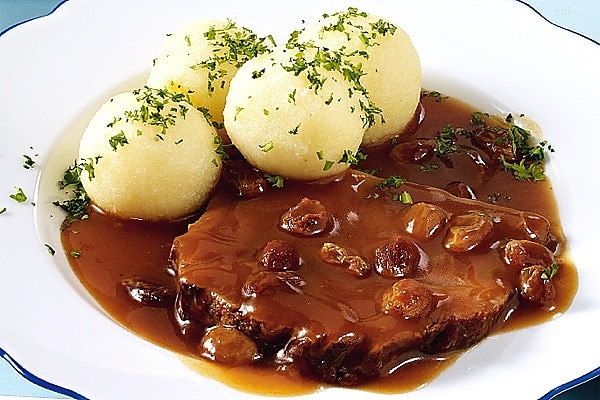

# Sauerbraten

*German pot-roast: beef marinated for days in red wine, vinegar and aromatics, then slow-braised. The sour-sweet sauce is thickened with crushed gingersnaps. The classic Sunday Rhineland roast; intensely flavoured, falls apart at a fork.*

**Serves:** 6-8

**Prep Time:** 30 minutes (plus 3-4 days marinade)

**Cook Time:** 3 hours

## Overview
A beef chuck or topside joint marinates 3-4 days in red wine vinegar, red wine and aromatics. The marinade strains, the meat browns deeply, and it braises slowly in the strained marinade with stock until tender. The braising liquid is finished with crushed gingersnaps for the signature sweet-thick sauce.

## Ingredients

### Marinade
- 1.5 kg beef topside or chuck (one piece)
- 500 ml red wine vinegar
- 500 ml dry red wine
- 500 ml water
- 2 onions (sliced)
- 2 carrots (sliced)
- 1 leek (sliced)
- 2 bay leaves
- 1 tablespoon black peppercorns
- 1 tablespoon mustard seeds
- 4 cloves
- 1 tablespoon juniper berries (optional)
- 1 cinnamon stick

### Braising
- 3 tablespoons vegetable oil
- 2 tablespoons plain flour
- 500 ml beef stock
- 80 g ginger snap biscuits (crushed; about 6-8 biscuits)
- 2 tablespoons raisins (optional)
- Salt and freshly ground black pepper

### To serve
- Potato dumplings (kartoffelklöße) or buttered red cabbage
- A tablespoon of chopped flat-leaf parsley

## Method

### Stage 1 – Marinate
1. Combine all marinade ingredients in a non-reactive container (glass or ceramic).
1. Submerge the beef.
1. Refrigerate for 3-4 days, turning the meat once a day.

### Stage 2 – Brown the meat
1. Lift the beef out; pat very dry. Strain the marinade and reserve the liquid.
1. Heat the oil in a heavy casserole over high heat.
1. Brown the beef on all sides for 8-10 minutes, building deep colour.

### Stage 3 – Braise
1. Sprinkle the flour over the meat; turn briefly.
1. Pour in 600 ml of the strained marinade and the beef stock.
1. Bring to a simmer; cover and braise on low heat for 2½-3 hours, or in a 160°C oven, until fork-tender.

### Stage 4 – Sauce
1. Lift the beef onto a board; rest, loosely covered.
1. Strain the braising liquid into a clean pan; skim fat.
1. Whisk in the crushed gingersnaps; simmer 5-8 minutes until thickened to a glossy sauce.
1. Stir in the raisins; taste; balance with salt or a splash of vinegar if needed.

### Stage 5 – Serve
1. Slice the beef thinly across the grain.
1. Spoon sauce over; scatter parsley.
1. Serve with dumplings and red cabbage.

## Notes
- **Marinate at least 3 days:** This is a long slow-cure. Less and the dish lacks the characteristic sourness.
- **Gingersnaps thicken AND flavour:** Don't substitute cornflour; you lose the spiced sweetness that defines the sauce.
- **Slice across the grain:** Topside has long fibres; perpendicular slicing gives tender bites.

## Storage
- Improves overnight. Keeps 4 days refrigerated.
- Freezes 3 months.
