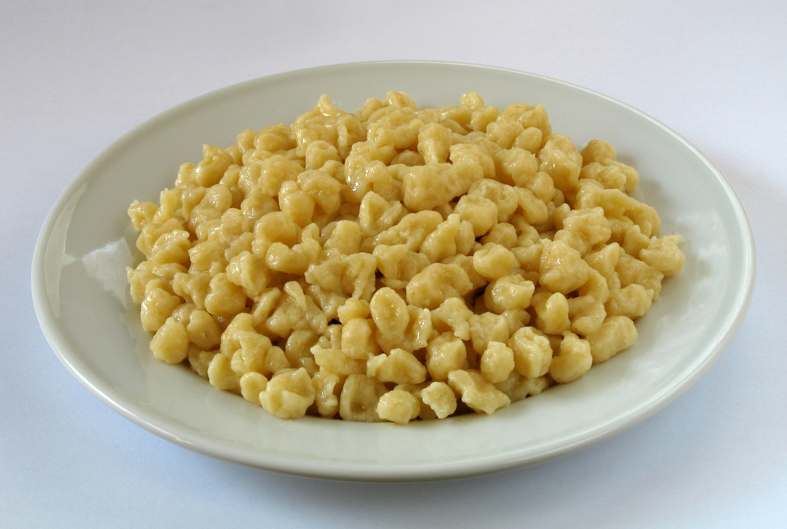

# Spätzle

*Swabian egg noodles: a wet flour-egg-milk batter pressed through a perforated tool into boiling water, where the strands set into soft chewy noodles. Served buttered as a side, or made into Käsespätzle (cheese spätzle) as a main course.*

**Serves:** 4

**Prep Time:** 10 minutes

**Cook Time:** 10 minutes

## Overview
A loose egg-rich batter rests briefly to relax the gluten. It presses through a spätzle press, colander, or grater into a pan of boiling salted water. The noodles cook in seconds, lift out, and toss with butter or build into other dishes.

## Ingredients

- 300 g plain flour
- 4 large eggs
- 150 ml whole milk
- 1 teaspoon salt
- A grating of nutmeg
- 50 g unsalted butter (for finishing)

## Method

### Stage 1 – Batter
1. Whisk the flour, eggs, milk, salt and nutmeg in a bowl until smooth.
1. The batter should be thick but pourable, like thick pancake batter.
1. Beat for 1-2 minutes (this develops some structure; the batter goes glossy).
1. Rest 10 minutes.

### Stage 2 – Boil and press
1. Bring a large pan of well-salted water to the boil.
1. Hold a spätzle press (or perforated colander, or coarse grater) over the simmering water.
1. Press the batter through; it falls into the water as small irregular strands.
1. Once the spätzle float to the surface (10-20 seconds), lift out with a slotted spoon into a colander.
1. Repeat with the rest of the batter.

### Stage 3 – Finish
1. Melt the butter in a wide pan.
1. Toss the spätzle through; warm through 1-2 minutes.
1. Season with salt and pepper.

## Notes
- **No spätzle press? Improvise:** A coarse box grater pressed against a colander works. A potato ricer with large holes also works. Even a wooden board with the batter scraped off the edge with a knife (the traditional way) works.
- **Don't crowd the water:** Press in batches; too many at once stick.
- **Eat fresh or use as a base:** Plain spätzle goes well with stews, schnitzel sauces, or builds into Käsespätzle.

## Storage
- Keeps 2 days refrigerated. Re-warm in butter; refresh with a splash of water.
- Freeze 2 months tossed with a little oil to prevent clumping.
