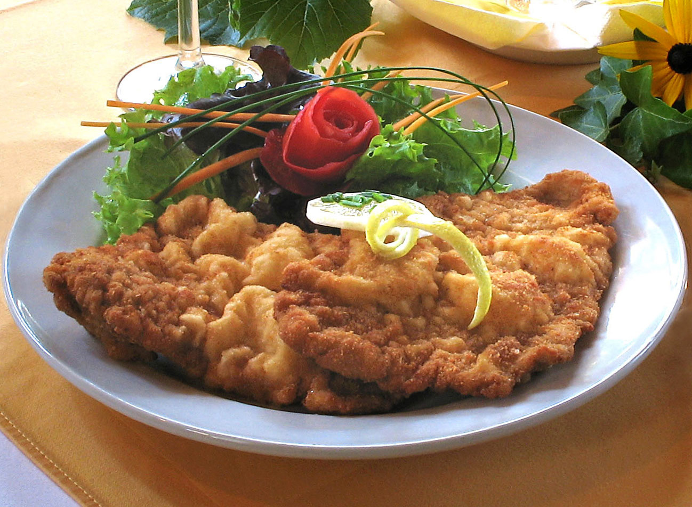

# Wiener Schnitzel

*Austrian veal cutlet pounded thin, breaded with flour-egg-breadcrumbs, and shallow-fried in lard or butter until pale gold. The crumb should puff away from the meat in soft folds. Served with a slice of lemon and parsley potatoes.*

**Serves:** 4

**Prep Time:** 20 minutes

**Cook Time:** 12 minutes

## Overview
Veal escalopes are pounded to 5 mm thick, dredged through flour, egg and breadcrumbs (each step distinct), then shallow-fried fast in plenty of fat until the crumb puffs into characteristic ripples. Lemon and parsley potatoes alongside.

## Ingredients

### Schnitzel
- 4 veal escalopes (about 150 g each)
- 100 g plain flour
- 3 large eggs (beaten)
- 200 g fine breadcrumbs (ideally Semmelbrösel; or fine dried breadcrumbs)
- Salt and freshly ground white pepper
- 100 g clarified butter (or 50 g butter + 50 ml vegetable oil)

### To serve
- 1 lemon (cut into wedges)
- A small bunch of flat-leaf parsley
- 600 g new potatoes (boiled, tossed with butter and parsley)
- Lingonberry jam (optional but traditional)

## Method

### Stage 1 – Pound the veal
1. Place each escalope between sheets of cling film.
1. Bash with a meat mallet or rolling pin to 5 mm thick. Even thickness is more important than thinness.

### Stage 2 – Bread
1. Set up three plates: flour seasoned with salt and white pepper, beaten egg, breadcrumbs.
1. Dredge each escalope in flour (shake off excess), dip in egg, then press lightly into the breadcrumbs.
1. Don't press hard; the looser coat is what allows the crumb to puff.

### Stage 3 – Fry
1. Heat a wide heavy pan over medium-high heat with enough clarified butter to cover the base by 5 mm.
1. The fat must be hot enough that breadcrumbs sizzle on contact (about 170°C); too cool and the schnitzel absorbs fat.
1. Slide one escalope into the pan; spoon hot fat over the top continuously while it cooks.
1. After 1½-2 minutes, the underside should be pale gold. Flip; cook another 1-1½ minutes.
1. Lift onto kitchen paper; salt immediately.
1. Repeat with the others, replenishing fat as needed.

### Stage 4 – Serve
1. Plate each schnitzel; the crumb should be puffed and rippled, not flat.
1. Serve with lemon wedges, a parsley sprig, parsley potatoes and lingonberry jam.

## Notes
- **Lots of hot fat:** Wiener schnitzel is shallow-fried, almost deep-fried; the depth of fat is what allows the crumb to "swim" and puff.
- **Spoon fat over the top:** Keeps the cooking even on both sides without flipping repeatedly.
- **Don't press the crumbs in:** A loose coat puffs into ripples. A pressed coat goes flat and dense.

## Storage
- Best the moment they're fried. Keeps 1 day refrigerated; reheat in a 180°C oven for 6 minutes (the crumb won't be quite as puffy).
