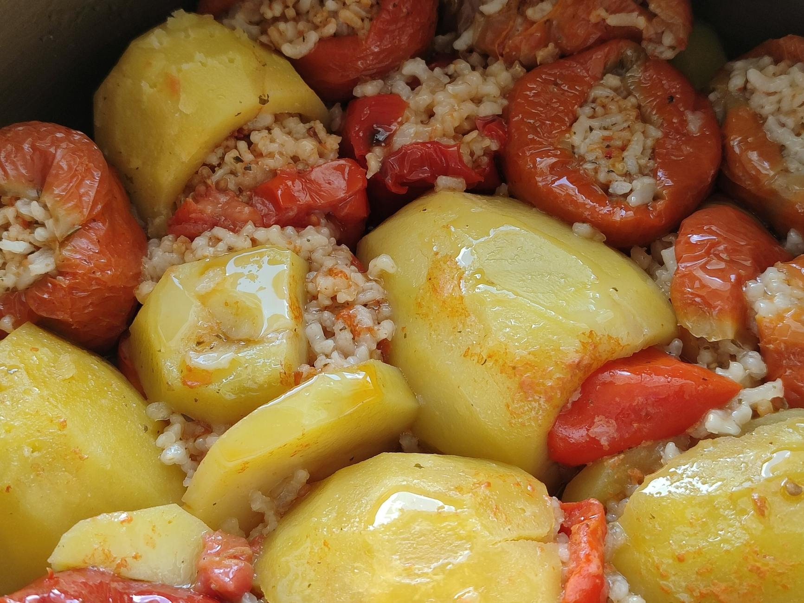

# Gemista

*Greek stuffed peppers and tomatoes — the vegetables hollowed out and filled with a rice mix loaded with herbs (mint, dill, parsley), pine nuts, currants and olive oil, then baked slow in a tray with potato wedges around them. The juices run; the rice swells; the peppers blister and soften. Eaten warm or at room temperature with bread and feta.*

**Serves:** 4-6

**Prep Time:** 30 minutes

**Cook Time:** 1¼ hours

## Overview
Tomatoes and peppers get tops cut off and centres scooped out. The tomato flesh is reserved and chopped. A rice filling cooks half-done in a pan with the chopped tomato flesh, onion, garlic and herbs. Vegetables fill; tops go back on. Potato wedges arrange around them in a tray; everything bakes slowly in olive oil and the reserved tomato juices until the rice is cooked through and the potatoes are golden.

## Ingredients

- 4 large beef tomatoes
- 4 large red, yellow or green peppers
- 4 medium potatoes (peeled and cut into thick wedges)

### Filling
- 5 tablespoons olive oil
- 2 large onions (finely chopped)
- 4 garlic cloves (crushed)
- 200 g long-grain rice (rinsed)
- 50 g pine nuts
- 50 g currants
- 1 teaspoon dried oregano
- A small bunch of mint (chopped)
- A small bunch of dill (chopped)
- A small bunch of flat-leaf parsley (chopped)
- 200 ml hot water
- 1 teaspoon sugar
- Salt and black pepper

### For the tray
- 4 tablespoons olive oil (extra)
- 1 teaspoon sugar
- 200 ml hot water

### To serve
- 200 g feta (crumbled)
- Crusty bread

## Method

### Stage 1 – Prep the vegetables
1. Heat the oven to 180°C (160°C fan).
1. Slice off the tops of the tomatoes (about 1 cm from the top); save them.
1. Scoop out the flesh and seeds with a teaspoon; chop the flesh roughly; save it.
1. Slice off the tops of the peppers; remove the seeds and pith.
1. Salt the inside of the tomatoes and peppers; turn upside down on a tray to drain 15 minutes.

### Stage 2 – Filling
1. Heat the 5 tablespoons of olive oil in a wide pan over medium heat.
1. Cook the onions 8 minutes until soft.
1. Add the garlic; cook 1 minute.
1. Add the rice; toast 2 minutes.
1. Add the chopped tomato flesh, pine nuts, currants, oregano, sugar, salt and pepper.
1. Pour in the 200 ml hot water; cover and cook 8 minutes — the rice will be half-done with most liquid absorbed.
1. Off the heat, stir in the mint, dill and parsley.

### Stage 3 – Stuff
1. Stand the tomatoes and peppers in a deep oven dish.
1. Spoon the rice mixture into each, filling about ¾ — the rice expands as it cooks.
1. Replace the tops.

### Stage 4 – Tray
1. Tuck the potato wedges around and between the stuffed vegetables.
1. Drizzle the extra 4 tablespoons olive oil over everything.
1. Mix the 200 ml hot water with the sugar and pour into the bottom of the dish.

### Stage 5 – Bake
1. Cover loosely with foil; bake 45 minutes.
1. Remove the foil; bake 25-30 minutes more until the vegetables are tender and slightly charred at the edges, the potatoes deeply golden, and the rice fully cooked.

### Stage 6 – Rest and serve
1. Rest 15 minutes — the dish settles, the juices redistribute.
1. Serve warm or at room temperature with crumbled feta and bread.

## Notes
- **Salt and drain:** Salting the insides and tipping upside down to drain stops the dish from drowning. Skip and the rice is wet and undercooked.
- **Rice half-done:** Pre-cooking the rice halfway in the pan means it finishes inside the vegetables without overcooking the vegetable shells.
- **Eat at room temperature:** Greek tradition holds that gemista tastes best slightly warm or at room temperature, when the flavours have had time to settle. Most Greek cooks make it in the morning for lunch.

## Storage
- Keeps 4 days refrigerated; tastes better the next day.
- Doesn't freeze well; the vegetables go limp.
