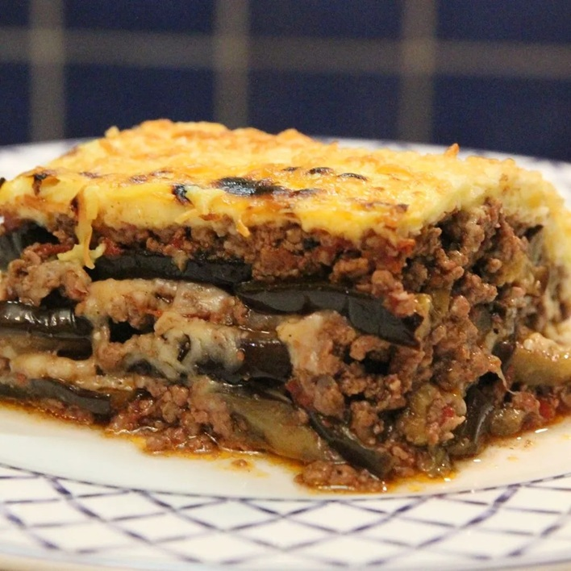

# Moussaka

*Greek baked layered dish: aubergine, spiced lamb mince, potato slices and a thick béchamel topping. The Mediterranean lasagne. Time-consuming but freezer-friendly; one tray feeds a family for two nights.*

**Serves:** 6-8

**Prep Time:** 45 minutes

**Cook Time:** 1 hour 15 minutes

## Overview
Aubergines and potatoes pan-fry or roast separately. Lamb mince cooks down with onion, garlic, cinnamon and tomato into a rich ragù. The layers go into a deep dish, topped with a cheese-rich béchamel that sets golden in the oven.

## Ingredients

### Layers
- 2 large aubergines (sliced 1 cm thick)
- 3 large potatoes (peeled, sliced 5 mm thick)
- Olive oil (for brushing/frying)
- Salt

### Lamb ragù
- 2 tablespoons olive oil
- 1 onion (finely chopped)
- 4 garlic cloves (crushed)
- 800 g lamb mince
- 2 tablespoons tomato purée
- 400 g tinned chopped tomatoes
- 150 ml red wine
- 1 cinnamon stick
- 1 teaspoon dried oregano
- ¼ teaspoon ground allspice
- 1 bay leaf
- Salt and freshly ground black pepper

### Béchamel
- 75 g unsalted butter
- 75 g plain flour
- 700 ml whole milk (warm)
- 2 large eggs (beaten)
- 100 g grated kefalotyri or parmesan
- A grating of nutmeg

## Method

### Stage 1 – Salt the aubergine
1. Salt the aubergine slices; leave 20 minutes in a colander, then pat dry.

### Stage 2 – Roast the aubergine and potato
1. Heat the oven to 200°C (180°C fan).
1. Brush both vegetables with olive oil; spread on baking trays in single layers.
1. Roast for 20-25 minutes until tender and golden. Set aside.

### Stage 3 – Lamb ragù
1. Heat the oil in a heavy pan; cook the onion 8 minutes until soft.
1. Add the garlic; 1 minute.
1. Add the lamb; brown well, breaking it up.
1. Stir in the tomato purée, then the wine; let it bubble away.
1. Add tomatoes, cinnamon, oregano, allspice and bay; season generously.
1. Simmer 25-30 minutes until thick. Discard cinnamon and bay.

### Stage 4 – Béchamel
1. Melt the butter; whisk in flour; cook 1 minute.
1. Add warm milk gradually, whisking, until smooth and thickened.
1. Off the heat, beat in the eggs (whisk fast or they scramble), cheese and nutmeg.

### Stage 5 – Assemble and bake
1. Reduce oven to 180°C (160°C fan).
1. Layer in a deep baking dish (about 30 x 20 cm): potatoes, half the lamb, aubergine, remaining lamb, more aubergine.
1. Pour béchamel evenly over the top.
1. Bake 45-50 minutes until golden and bubbling.
1. Rest at least 15 minutes before slicing (essential — it firms up).

## Notes
- **Salt the aubergine:** Removes bitterness and stops it sponging up oil. 20 minutes is enough.
- **Don't skip the rest:** Cutting straight from the oven gives a sloppy plate. 15-20 minutes lets the layers set.
- **Cinnamon and allspice are non-negotiable:** Defines moussaka against a generic ragù.

## Storage
- Improves overnight. Keeps 4 days refrigerated.
- Reheat at 180°C for 25 minutes covered.
- Freezes well for 3 months.
