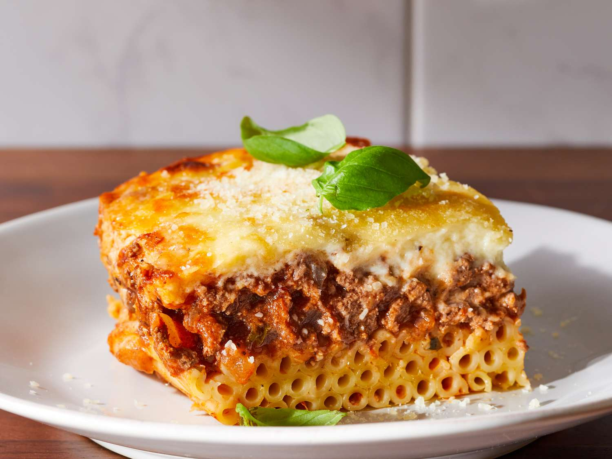

# Pastitsio

*Greek baked pasta: long tubes of bucatini or ziti layered with cinnamon-spiced beef ragù and topped with a thick béchamel. The Greek answer to lasagne; richer, sweeter, defined by the spices.*

**Serves:** 6-8

**Prep Time:** 30 minutes

**Cook Time:** 1 hour

## Overview
Pasta tubes get a quick boil and a buttery toss. A beef ragù with cinnamon, allspice and a touch of tomato cooks while the pasta drains. Béchamel — thick, egg-bound, cheese-spiked — pours over the top. Bakes until the surface is mahogany-bronze.

## Ingredients

### Pasta
- 400 g bucatini or ziti
- 30 g unsalted butter
- 50 g grated kefalotyri or parmesan
- 1 egg (beaten)

### Beef ragù
- 2 tablespoons olive oil
- 1 onion (finely chopped)
- 4 garlic cloves (crushed)
- 700 g beef mince
- 2 tablespoons tomato purée
- 400 g tinned chopped tomatoes
- 150 ml red wine
- 1 cinnamon stick
- ¼ teaspoon ground allspice
- 1 bay leaf
- 1 teaspoon dried oregano
- Salt and freshly ground black pepper

### Béchamel
- 75 g unsalted butter
- 75 g plain flour
- 800 ml whole milk (warm)
- 2 large eggs (beaten)
- 100 g grated kefalotyri or parmesan
- A grating of nutmeg

## Method

### Stage 1 – Beef ragù
1. Heat the oil; cook the onion 8 minutes; add garlic 1 minute.
1. Brown the beef thoroughly.
1. Stir in tomato purée; pour wine; let bubble away.
1. Add tomatoes, cinnamon, allspice, bay, oregano. Season.
1. Simmer 25-30 minutes until thick. Discard cinnamon and bay.

### Stage 2 – Pasta
1. Cook the pasta in salted water 1 minute shy of al dente; drain.
1. Toss with butter, cheese and the beaten egg (the egg sets the layer in the oven).

### Stage 3 – Béchamel
1. Melt butter; whisk in flour; cook 1 minute.
1. Add warm milk gradually, whisking until thick.
1. Off the heat, beat in eggs (whisk fast), cheese and nutmeg.

### Stage 4 – Assemble and bake
1. Heat oven to 180°C (160°C fan).
1. In a deep 30 x 20 cm baking dish: half the pasta, all the beef, remaining pasta.
1. Pour béchamel evenly across the top.
1. Bake 40-45 minutes until deep golden.
1. Rest 15 minutes before slicing.

## Notes
- **Tubular pasta only:** Bucatini or ziti so the long noodles slice through neatly. Penne or short pasta give a crumbly texture.
- **Egg in the pasta layer:** Sets the bottom into a sliceable layer; without it the noodles slip apart.
- **Cinnamon defines it:** Like moussaka. A pastitsio without cinnamon is a Greek-flavoured lasagne.

## Storage
- Improves overnight. Keeps 4 days refrigerated.
- Freezes 3 months.
