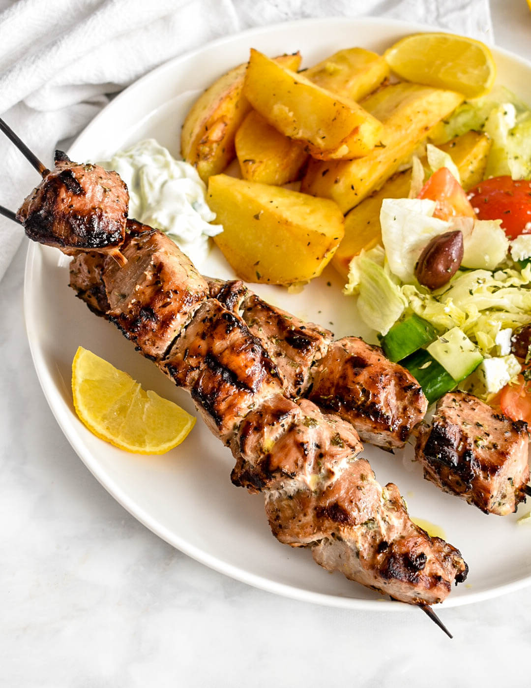

# Pork Souvlaki

*Greek pork skewers: cubed pork shoulder marinated in lemon, olive oil, oregano and garlic, then grilled over high heat. Served with pita, tzatziki, salad and grilled vegetables. The Athens lunch counter staple.*

**Serves:** 4

**Prep Time:** 15 minutes (plus 2 hours marinade)

**Cook Time:** 12 minutes

## Overview
Pork shoulder cubes marinate at least two hours in a lemon-olive oil-garlic-oregano mix. Threaded onto skewers and grilled hot. Three minutes a side; rest briefly; serve with the standard mezze.

## Ingredients

### Pork
- 800 g pork shoulder (cut into 3 cm cubes)
- 8 wooden skewers (soaked 30 minutes) or metal

### Marinade
- 100 ml olive oil
- Juice of 2 lemons
- 4 garlic cloves (crushed)
- 1 tablespoon dried Greek oregano
- 1 teaspoon salt
- ½ teaspoon black pepper
- 1 teaspoon sweet paprika

### To serve
- 4 pita breads (warmed)
- Tzatziki
- 1 red onion (sliced)
- 2 tomatoes (sliced)
- A handful of fresh oregano (or parsley)
- Lemon wedges

## Method

### Stage 1 – Marinate
1. Whisk all marinade ingredients in a bowl.
1. Toss the pork cubes through; cover and refrigerate at least 2 hours, ideally 4-6.

### Stage 2 – Skewer
1. Thread 5-6 pork cubes onto each skewer, leaving small gaps for even cooking.

### Stage 3 – Grill
1. Heat a griddle pan or BBQ over high heat until smoking.
1. Cook the skewers for 3 minutes a side, turning twice (12 minutes total) until well charred and cooked through.

### Stage 4 – Rest and serve
1. Rest the skewers on a board for 3 minutes.
1. Warm the pitas briefly on the grill.
1. Serve skewers with pita, tzatziki, sliced onion and tomato, fresh oregano and a squeeze of lemon.

## Notes
- **Greek oregano (rigani):** Drier and more aromatic than Italian oregano; defines the marinade. Find at any Mediterranean grocer.
- **Pork shoulder, not loin:** Loin is too lean; shoulder has the fat to stay juicy on the grill.
- **High heat for char:** A medium grill steams the meat. Smoking-hot grill, fast cook, then rest.

## Storage
- Best fresh. Keeps 2 days refrigerated; reheat briefly under a hot grill.
