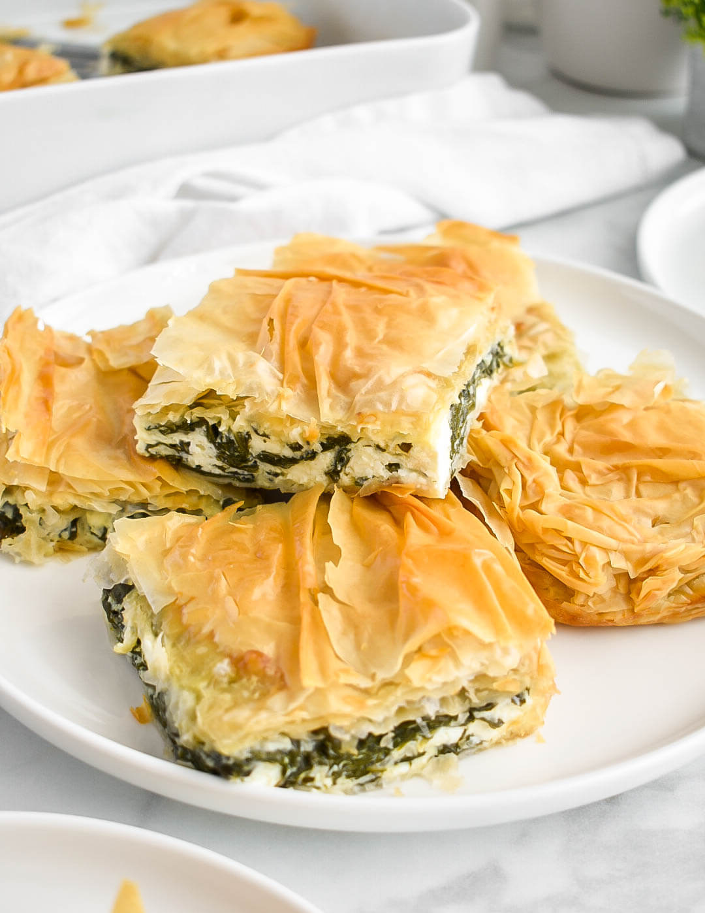

# Spanakopita

*Greek spinach and feta pie: layers of crisp filo enclosing a generously herbed spinach-and-cheese filling. Eats hot as a main, room temperature as a starter, cold from the fridge for breakfast.*

**Serves:** 6-8

**Prep Time:** 30 minutes

**Cook Time:** 45 minutes

## Overview
Spinach wilts and squeezes dry; mixes with crumbled feta, ricotta, eggs, dill and spring onions. The filling goes between layers of filo brushed with melted butter; baked until the top shatter-crisps.

## Ingredients

### Filling
- 1 kg fresh spinach (or 600 g frozen, thawed)
- 1 tablespoon olive oil
- 1 small onion (finely chopped)
- 6 spring onions (sliced)
- 4 garlic cloves (crushed)
- 300 g feta (crumbled)
- 200 g ricotta
- 3 large eggs (beaten)
- A small bunch of dill (chopped)
- A small bunch of parsley (chopped)
- A grating of nutmeg
- Salt and black pepper

### Pastry
- 270 g filo pastry (10-12 sheets)
- 100 g unsalted butter (melted)
- 2 tablespoons olive oil

## Method

### Stage 1 – Spinach
1. Wilt the spinach in a dry pan in batches (or thaw frozen). Squeeze hard in a clean cloth to remove ALL liquid (this is structural — wet filling makes soggy pie). Chop roughly.

### Stage 2 – Filling
1. Heat the olive oil; cook the onion 5 minutes; add spring onions and garlic, cook 2 more minutes. Cool slightly.
1. Mix with the spinach, feta, ricotta, eggs, dill, parsley, nutmeg, salt and pepper.

### Stage 3 – Layer
1. Heat the oven to 180°C (160°C fan).
1. Combine the melted butter and oil in a small bowl.
1. Brush a 30 x 20 cm baking dish with the butter mixture.
1. Lay one filo sheet in the dish (let edges hang over); brush with butter mixture.
1. Repeat with 5 more sheets, brushing each.
1. Spread the spinach filling evenly.
1. Top with 6 more filo sheets, each brushed with butter mixture.
1. Tuck or fold the overhanging edges in to seal.

### Stage 4 – Score and bake
1. Score the top filo into serving portions with a sharp knife (don't cut all the way through).
1. Bake 40-45 minutes until deep golden and crisp.
1. Cool 10 minutes before serving (lets the filling set).

## Notes
- **Squeeze the spinach DRY:** This is the entire structural difference between good spanakopita and a wet sad one. Get it bone-dry.
- **Score before baking:** Cuts cleanly through crisp filo. Trying to slice baked spanakopita shatters the top.
- **Filo dries fast:** Keep unused sheets covered with a damp cloth as you work.

## Storage
- Keeps 3 days refrigerated; the filo softens. Re-crisp in a 180°C oven for 10 minutes.
- Freezes well baked or unbaked for 2 months.
