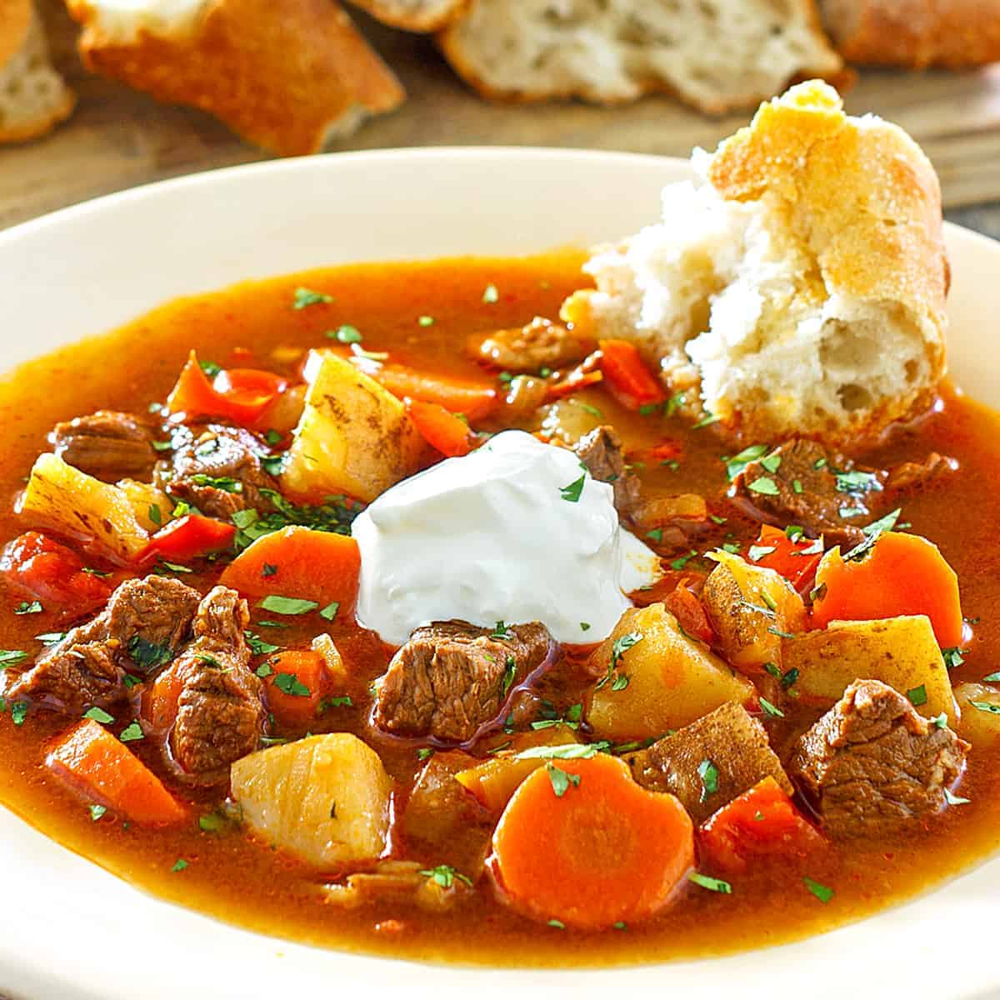

# Hungarian Goulash

*Hungary's national dish: chunks of beef simmered slow with onions, sweet paprika and tomato into a rust-coloured stew. Originally a herder's dish cooked over open fires; modern versions are richer and thicker. Not the German "goulash" with sour cream — that's pörkölt-adjacent and a different thing.*

**Serves:** 6

**Prep Time:** 20 minutes

**Cook Time:** 2½ hours

## Overview
Beef chuck cubes brown briefly, then simmer slow in a generous onion base with paprika as the dominant spice. Tomato, garlic and caraway add depth; potatoes go in late. The defining flavour is the paprika — Hungarian sweet paprika, not generic Spanish; the colour and flavour are different.

## Ingredients

- 1 kg beef chuck (cut into 3 cm cubes)
- 3 tablespoons lard or vegetable oil
- 4 onions (chopped; equal weight to the meat is traditional)
- 4 garlic cloves (crushed)
- 4 tablespoons Hungarian sweet paprika
- 1 teaspoon Hungarian hot paprika (or to taste)
- 1 teaspoon caraway seeds (lightly crushed)
- 2 tablespoons tomato purée
- 400 g tinned chopped tomatoes
- 1 red pepper (chopped)
- 2 bay leaves
- 1 litre beef stock
- 600 g potatoes (peeled, cubed)
- Salt and freshly ground black pepper
- A small bunch of flat-leaf parsley (chopped)

## Method

### Stage 1 – Brown
1. Heat the lard in a heavy casserole over medium-high heat.
1. Season the beef; brown in batches deeply. Set aside.

### Stage 2 – Onions
1. Reduce heat to medium. Add the onions to the pan with a pinch of salt.
1. Cook 15-20 minutes, stirring often, until very soft and golden. (This is the structural step; rushing the onions gives flat goulash.)
1. Add the garlic; cook 1 minute.

### Stage 3 – Paprika
1. Take the pan OFF the heat. Add both paprikas and the caraway; stir for 30 seconds (paprika burns at high heat and turns bitter).
1. Return to medium heat.

### Stage 4 – Build the stew
1. Stir in the tomato purée; cook 1 minute.
1. Return the beef. Add the chopped tomatoes, red pepper, bay leaves and stock.
1. Bring to a simmer. Season with salt and pepper.
1. Cover and braise on low heat for 1½ hours (or in a 160°C oven), stirring occasionally.

### Stage 5 – Potatoes
1. Add the cubed potatoes; cook another 30-40 minutes until both meat and potatoes are tender and the sauce has thickened.

### Stage 6 – Serve
1. Discard the bay leaves.
1. Taste; season again.
1. Ladle into bowls; scatter parsley.
1. Serve with crusty bread or buttered noodles.

## Notes
- **Hungarian paprika is non-negotiable:** Spanish paprika tastes different. Hungarian sweet paprika (édes paprika) has a brighter red colour and slightly sweet character.
- **Don't burn the paprika:** Off-the-heat addition is critical. Even 30 seconds at high heat turns paprika acrid; the dish never recovers.
- **Lots of onions:** Equal weight to the meat. They cook down to a sweet base; less and the stew is thin.

## Storage
- Improves overnight. Keeps 4 days refrigerated.
- Freezes 3 months.
