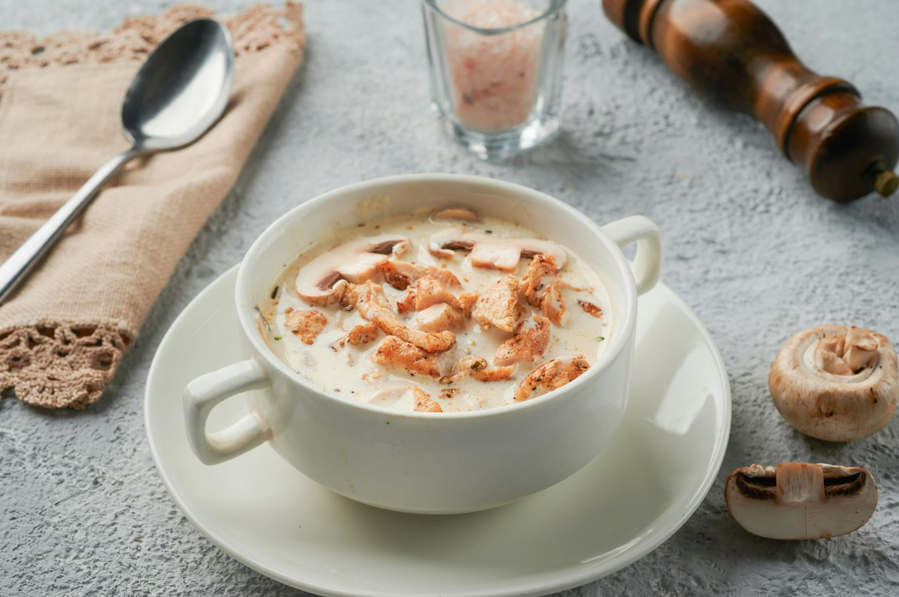

# Hungarian Mushroom Soup

*Gombaleves: a creamy, dill-flecked, paprika-rich mushroom soup with sour cream stirred in at the end. Earthy and brothy at once; the sour cream and dill keep it from being heavy. A weekday lunch that punches well above its weight.*

**Serves:** 4

**Prep Time:** 15 minutes

**Cook Time:** 30 minutes

## Overview
Onions and mushrooms cook in butter until the mushrooms have released and reabsorbed their liquid. Paprika blooms off the heat; flour stirs in to thicken; vegetable stock joins. Dill and milk finish the soup; sour cream is whisked in just before serving with a squeeze of lemon.

## Ingredients

- 50 g unsalted butter
- 1 large onion (finely chopped)
- 600 g mixed mushrooms (chestnut, plus a handful of oyster mushrooms or porcini; sliced)
- 2 garlic cloves (crushed)
- 2 tablespoons sweet Hungarian paprika
- 2 tablespoons plain flour
- 1 litre vegetable stock
- 200 ml whole milk
- 3 tablespoons fresh dill (chopped)
- 200 ml soured cream
- 2 tablespoons soy sauce
- Juice of half a lemon
- Salt and black pepper
- A few extra dill fronds (to serve)

## Method

### Stage 1 – Mushrooms
1. Melt the butter in a heavy pan over medium heat.
1. Cook the onion 5 minutes until soft.
1. Add the mushrooms; cook 10 minutes, stirring, until they release their liquid and it cooks back off — the pan will go almost dry.
1. Stir in the garlic; cook 1 minute.

### Stage 2 – Paprika and flour
1. Pull off the heat. Stir in the paprika; return to low heat.
1. Sprinkle the flour over; stir 1 minute to cook it out (no browning).

### Stage 3 – Build the soup
1. Pour in the stock gradually, whisking. Bring to a steady simmer.
1. Stir in the milk and 2 tablespoons of the dill.
1. Simmer 10 minutes, stirring occasionally.

### Stage 4 – Finish
1. Off the heat, whisk a couple of ladlefuls of the hot soup into the soured cream (tempers it so it doesn't split).
1. Stir the soured cream mix back into the pan.
1. Add the soy sauce, lemon juice, salt and black pepper. Taste and adjust.

### Stage 5 – Serve
1. Ladle into bowls; scatter the remaining dill on top.

## Notes
- **Don't boil after the cream:** Soured cream curdles in a hard simmer. Once it's in, keep the heat off or very gentle.
- **Soy sauce in a Hungarian soup:** Untraditional but adds depth (umami) that this style of soup loses without meat. Skip if you prefer to keep it strictly Hungarian; salt to compensate.
- **Mushroom mix:** Chestnuts give body; a few wild or dried (rehydrated) mushrooms give the proper earthy note.

## Storage
- Keeps 3 days refrigerated; reheat gently without boiling.
- Doesn't freeze well due to the dairy.
