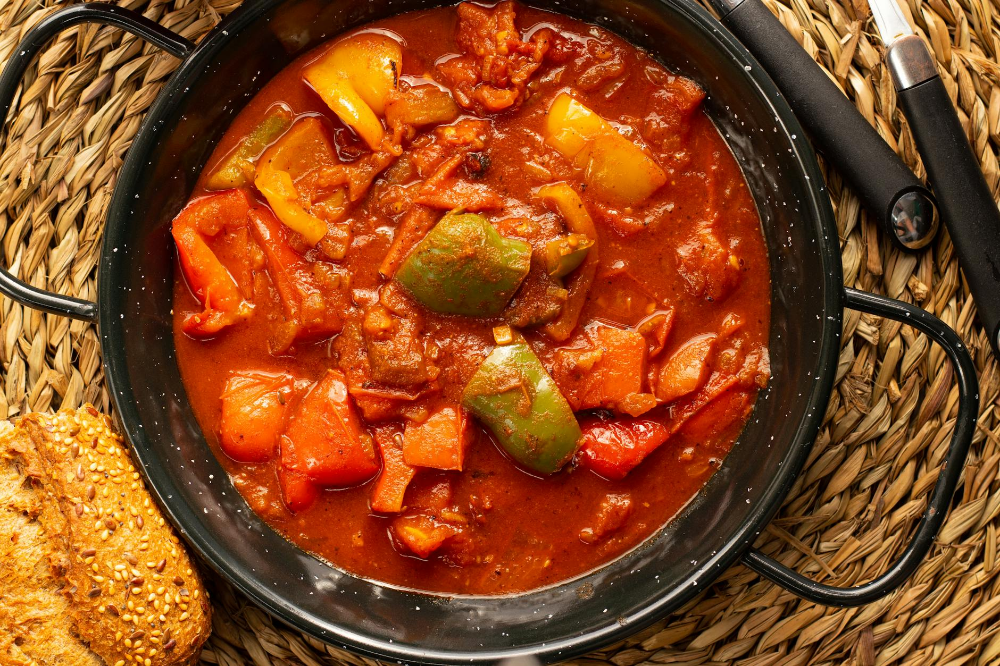

# Lecsó

*Hungary's pepper, tomato and onion stew, sweet and slightly smoky from sweet paprika, just enough fat to make it glossy. The summer dish — eaten on bread, over rice, with eggs broken in at the end, or alongside meat or fish. The first thing Hungarian cooks make when peppers come into season.*

**Serves:** 4

**Prep Time:** 15 minutes

**Cook Time:** 30 minutes

## Overview
Onion softens in oil; sweet paprika blooms off the heat (don't burn it). Strips of yellow pepper go in next to soften. Tomatoes follow; the lot stews until the peppers are silky and the sauce has reduced to a thick, jammy compote. Often finished with eggs or an egg yolk for richness.

## Ingredients

- 4 tablespoons sunflower oil (or 50 g unsalted butter)
- 2 large onions (sliced)
- 1 tablespoon sweet Hungarian paprika
- ½ teaspoon hot Hungarian paprika (optional)
- 6 large yellow Hungarian peppers or yellow bell peppers (deseeded and sliced 1 cm thick)
- 4 large ripe tomatoes (chopped) or 1 x 400 g tin chopped tomatoes
- 1 teaspoon sugar
- Salt and black pepper
- 2-4 large eggs (optional, to finish)

## Method

### Stage 1 – Onions
1. Heat the oil in a heavy wide pan over medium-low heat.
1. Cook the onions 10 minutes until soft and just turning golden.

### Stage 2 – Paprika
1. Pull the pan off the heat (paprika burns instantly on direct heat).
1. Stir in the paprika and hot paprika; the mixture will turn bright orange.
1. Return to medium heat.

### Stage 3 – Peppers
1. Add the peppers; toss to coat.
1. Cook 5-6 minutes, stirring, until they start to soften.

### Stage 4 – Tomatoes
1. Add the tomatoes, sugar, salt and black pepper.
1. Reduce the heat; simmer uncovered 15-20 minutes until the peppers are silky and the sauce has thickened to a glossy, jammy stew. The peppers should fold easily but still hold shape.

### Stage 5 – Eggs (optional)
1. Make wells in the lecsó; crack the eggs into them.
1. Cover and cook 4-5 minutes until the whites are set and the yolks still soft.

## Notes
- **Hungarian paprika is the dish:** Mild Spanish paprika gives the wrong flavour; smoked is wrong too. Track down sweet Hungarian (édes) and hot (csípős) for the proper taste.
- **Burnt paprika is bitter:** Always pull the pan off the heat before adding it. This is the most common lecsó mistake.
- **Yellow peppers:** Hungarian "tv paprika" or fehérpaprika is the traditional choice. Yellow bell peppers are fine; red works but tastes sharper.

## Storage
- Keeps 4 days refrigerated; the flavour deepens. Eat eggs the day they're added.
- Freezes 2 months without eggs.
