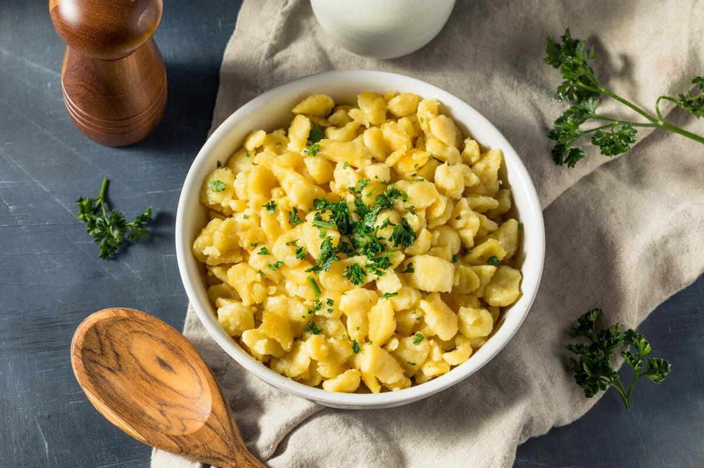

# Tojásos Nokedli

*Hungary's egg dumplings: rough, drop-spaetzle-style nokedli boiled and finished in beaten eggs that just-set into ribbons among them. A 15-minute supper, eaten with a green salad or pickled cucumbers; the comfort food version of pasta with butter and egg.*

**Serves:** 2-3

**Prep Time:** 10 minutes

**Cook Time:** 12 minutes

## Overview
A loose batter of flour, egg and water gets pushed through a spätzle plane (or a colander with large holes) into salted boiling water; the dumplings cook in a minute and lift out. They go into a buttery pan; beaten eggs pour over and just-set as you fold them through. Salt, pepper, parsley.

## Ingredients

### Nokedli
- 250 g plain flour
- 2 large eggs
- 150 ml water
- 1 teaspoon salt

### Finishing
- 50 g unsalted butter
- 4 large eggs (beaten)
- ½ teaspoon salt
- Black pepper
- 2 tablespoons fresh parsley (chopped)

## Method

### Stage 1 – Batter
1. Beat the eggs with the water and salt.
1. Whisk in the flour to make a thick batter — pourable but lumpy, like a bread batter. Rest 10 minutes.

### Stage 2 – Cook the nokedli
1. Bring a large pan of salted water to a rolling boil.
1. Press the batter through a spätzle plane or a wide-holed colander directly into the water. Work in 2-3 batches.
1. The dumplings cook in 60-90 seconds — they float; lift out with a slotted spoon and drain.

### Stage 3 – Eggs
1. Wipe out the empty pan or use a fresh one; melt the butter over medium heat.
1. Add the drained nokedli; toss to coat.
1. Pour over the beaten eggs; stir gently with a spatula. The eggs will set in 60-90 seconds — fold once or twice but don't overwork; you want soft ribbons of cooked egg, not scramble.

### Stage 4 – Serve
1. Off the heat, sprinkle in salt, pepper and parsley.
1. Serve hot, ideally with a green salad or pickled cucumbers.

## Notes
- **Spätzle plane vs colander:** A spätzle plane (lapostészta-szaggató) gives even, comma-shaped dumplings; a colander with large holes works as a stand-in. A potato ricer can work too.
- **Don't overcook the eggs:** This is more "moistened with egg" than "scrambled with dumplings". Pull off the heat the second they look just-set.
- **Salt the water properly:** Pasta-water salty.

## Storage
- Best fresh. Cooked nokedli (without the eggs) refrigerates 2 days; reheat in butter and add the eggs as above.
