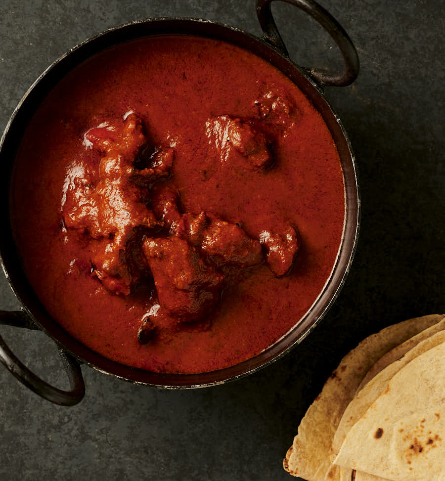

# Red Masala Sauce

## Overview
A simple spiced yoghurt marinade used for tandoori-style dishes. Combines yoghurt with tandoori paste, warming spices, and a touch of lemon juice to create a vibrant red coating for chicken, lamb, or vegetables before grilling or roasting.

## Ingredients
- 500 ml yoghurt
- Pinch of chilli powder
- Pinch of garam masala
- Pinch of coriander powder
- 1 tsp salt
- 1 heaped tbsp Pataks tandoori paste
- 1 level tsp garlic and ginger paste
- 1 tbsp red food colouring
- Few squirts of lemon juice

## Method
1. Mix all ingredients together thoroughly.

## Notes
- **Consistency:** The marinade should be thick enough to coat the back of a spoon; adjust with a little more yoghurt if too thick.
- **Colour:** The red food colouring is traditional for restaurant-style presentation; it can be omitted without affecting flavour.
- **Marinating time:** For best results, marinate protein for at least 2 hours, or overnight in the refrigerator.

## Serving
Use as: A marinade for tandoori chicken, lamb chops, king prawns, or vegetables before grilling or roasting.

## Storage
- Refrigerate unused marinade in a sealed container for up to 3 days
- Do not freeze once mixed with yoghurt
