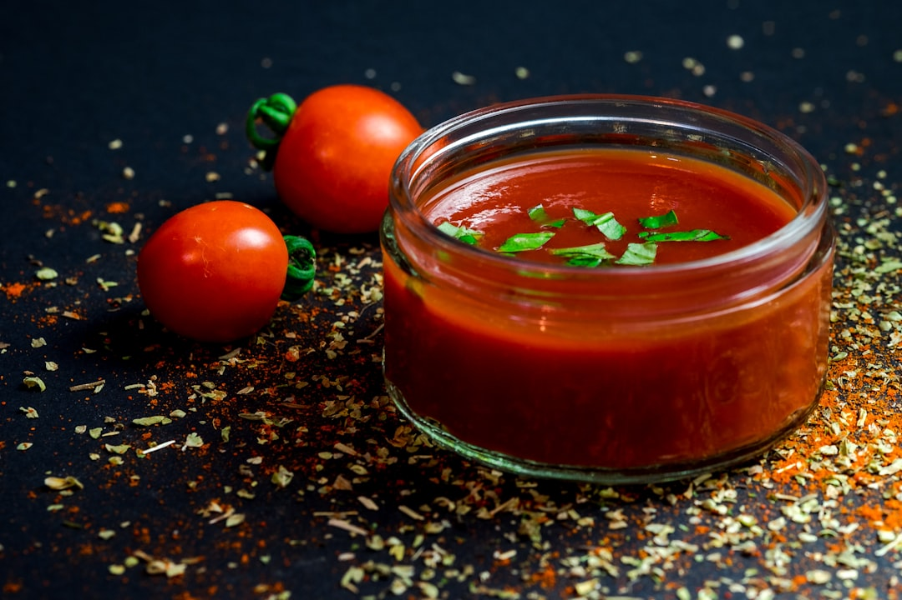

# Tomato Puree

*This is simply a thin purée of tomatoes used in many curries for flavour and colour. Here are two ways you can make it.*

## Method
### Method 1
1. Mix 1 part concentrated tomato paste with 3 parts water. 

### Method 2
1. Blend a 400g tin (2 cups) of plum tomatoes to a smooth purée. 
1. Add a little concentrated tomato paste if you want a deeper red colour. 

### Method 3
1. Sieved, unseasoned Italian passata. 