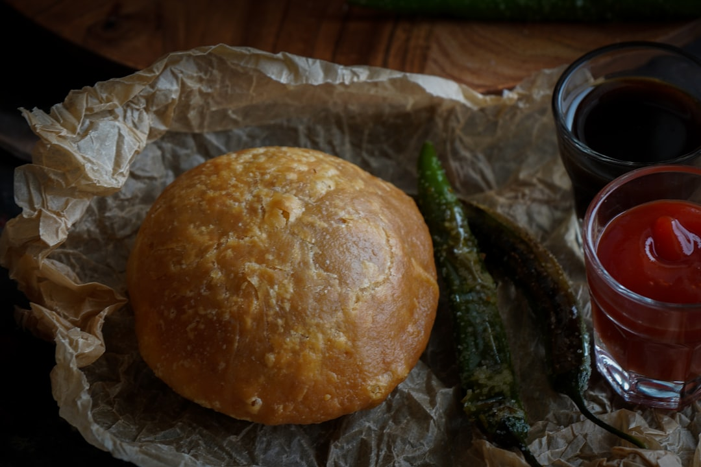

# Bhatura

**Makes:** 8 bhatura

**Prep Time:** 30 minutes

**Cook Time:** 10 minutes

## Overview
Soft, slightly leavened Indian flatbreads traditionally served with chole (chickpea curry). The addition of yoghurt gives bhatura weight and flavor, making them a street-food favorite.

## Ingredients
### Yeast starter
- 1 tsp sugar
- 2 tsp fast-action/instant active dried yeast
- 175 ml (6 fl oz/⅔ cup) warm water

### Dough
- 240 g (8½ oz/generous 1½ cups) plain/all-purpose flour, plus extra for rolling
- 1½ tbsp plain yogurt
- 1 tbsp melted ghee
- Pinch of salt

### Frying
- Vegetable oil, for frying (about 5 cm/2 inches deep in pan)

## Method

### Stage 1 – Activate yeast
1. In large bowl, combine warm water, sugar, and yeast.
1. Stir and leave 5 mins until frothy.

### Stage 2 – Make dough
1. Add flour, yoghurt, ghee, and salt; mix to form dough.
1. Add splash more water if needed; knead 8 mins until smooth.
1. Cover with damp cloth; prove 30 mins until slightly risen.

### Stage 3 – Shape bhatura
1. Divide dough into 8 equal portions.
1. Lightly flour surface; roll each into 14 cm (5½ inch) circle.

### Stage 4 – Fry
1. Heat oil in large non-stick pan over medium.
1. Test oil with small dough piece; it should sizzle and float.
1. Fry bhaturas one at a time, flipping once, until golden brown all over.
1. Drain on paper towels and serve immediately.

## Notes
- Bhatura is best served fresh and hot.
- Keep rolled bhatura covered while frying to prevent drying.
- For extra flavor, brush with melted ghee before serving.

## Serving
- Serve with chole (chickpea curry), onion salad, and pickles.

## Storage
- Bhatura are best eaten immediately.
- If needed, store cooled in airtight container 1 day, then reheat on hot pan.