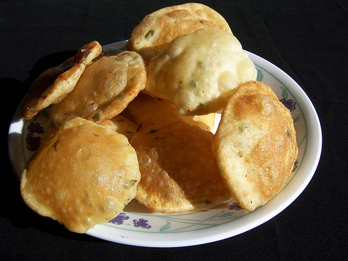

# Chilli Pooris

*Pooris are small discs of dough that puff into light, airy bubbles when slipped into hot oil; lightly studded with chopped chilli, this version leaves a warm glow at the back of the throat without overwhelming the bread itself.*

**Makes:** 12 pooris

**Prep Time:** 15 minutes (plus 30 minutes rest)

**Cook Time:** 10 minutes

## Overview
Small deep-fried Indian flatbreads built on a half-and-half mix of plain and wholemeal flour, spiked with chilli powder and chopped fresh chilli. Each piece puffs in seconds in the hot oil and stays crisp for a few minutes off the heat. Best served straight from the pan alongside a north Indian curry or pickles and yoghurt.

## Ingredients

### Dough
- 115 g plain flour
- 115 g wholemeal flour
- ½ teaspoon salt
- ½ teaspoon mild chilli powder
- 2 tablespoons vegetable oil
- 1 fresh red chilli (de-seeded and finely chopped)
- 100 ml water (an extra 20 ml may be needed if the dough is firm)

### Frying
- Vegetable oil (for deep frying)

## Method

### Stage 1 – Make the dough
1. Sift the flours, salt and chilli powder into a large bowl.
1. Add the vegetable oil, then mix in enough water to form a dough.
1. Turn out onto a lightly floured surface and knead for 10 minutes, until the dough is smooth, elastic and springy.
1. Place in a lightly oiled bowl, cover with cling film and rest for 30 minutes.

### Stage 2 – Shape
1. Turn the rested dough onto a lightly floured surface.
1. Knead in the chopped fresh chilli and divide the dough into 12 equal pieces.
1. Keeping the rest of the dough covered, roll one piece into a 13 cm round.
1. Repeat with the remaining dough, stacking the rolled pooris between sheets of cling film so they don't dry out.

### Stage 3 – Fry
1. Pre-heat the oven to a low 100°C.
1. Pour oil into a deep pan to a depth of 2.5 cm and heat to 180°C, or until a cube of day-old bread browns in about 45 seconds.
1. Lift one poori with a spatula and slide it into the oil; it will sink, then rise and begin to sizzle.
1. Press gently into the oil so it puffs, then turn after a few seconds and cook for a further 20-30 seconds.
1. Lift onto kitchen paper to drain, then keep warm in the low oven while frying the remaining pooris.

## Notes
- **Two flours:** The plain flour gives the dough enough gluten to puff, while the wholemeal carries the flavour; one without the other tends to either fail to puff or taste bland.
- **Oil temperature:** Too cool and the poori won't puff; too hot and the outside burns before the inside cooks. The bread-cube test is more reliable than a thermometer for shallow fryers.
- **Chilli twice:** Powder in the dough sets a baseline heat; the chopped fresh chilli is kneaded in last so you get small, distinct flecks rather than uniform spice.
- **Press to puff:** The brief press into the oil with a spatula is what triggers the puff; flat pooris that didn't catch usually weren't pressed.

## Serving
Serve with: A north Indian curry (chana masala, dal makhani) or pickles and yoghurt.
Garnish with: A pinch of flaky salt while still warm.

## Storage
- Best eaten the moment they come out of the oil.
- Cooked pooris go leathery within an hour; reheating in a low oven for a couple of minutes restores some crispness.
- The dough keeps overnight refrigerated, but bring it back to room temperature before rolling.
