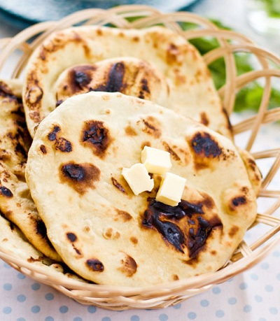

# Naan

*The naan and the tandoor it bakes in were brought to the North-West Frontier by the ancient Persians, who called them respectively "nane" and "tonir", and from there they passed to Baltis and Kashmiris as a staple. The traditional teardrop shape comes from the bread being pressed onto the inside neck of the tandoor, where gravity pulls the dough downwards as it cooks.*

**Makes:** 2 large naan

**Prep Time:** 15 minutes (plus 2 hours proving)

**Cook Time:** 10 minutes

## Overview
A grill-cooked version of the traditional tandoor naan: large, light and slightly sweet, with a chewy crumb and a sesame and onion-seed crust. Yoghurt and a touch of sugar in the dough give it the soft, almost briochey texture that the tandoor's blast of heat usually produces. It's the wrap that should hold a kebab, or sit alongside a Balti on the table.

## Ingredients

### Dough
- 450 g strong white flour
- 1 tablespoon baking powder
- 1 tablespoon granulated sugar
- 2 tablespoons Greek yoghurt
- 1 teaspoon aromatic salt
- 2 teaspoons sesame seeds
- ½ teaspoon wild onion seed (kalonji / nigella)
- Lukewarm water (as needed)

### To finish
- A little ghee (melted)

## Method

### Stage 1 – Mix the dough
1. Choose a large ceramic or glass bowl and put in all the dough ingredients.
1. Add warm water a little at a time, working it into the flour with your fingers until the mixture comes together as a single lump.

### Stage 2 – Knead and prove
1. Tip the dough onto a floured board and knead until well combined and smooth.
1. Return the dough to the bowl and leave in a warm place for a couple of hours to prove.
1. Knock the dough back by kneading it down to its original size.

### Stage 3 – Shape
1. Divide the dough into two equal lumps.
1. Shape each lump into a ball, then on a floured work surface roll each ball into a disc about 25 cm in diameter, at least 5 mm thick.

### Stage 4 – Grill
1. Pre-heat the grill to three-quarters heat.
1. Cover the rack with foil and place at the bottom of the grill so the bread has room to expand without burning.
1. Place the first naan on the foil and grill, watching the bread closely.
1. As soon as the upper side develops brown patches, remove from the grill and turn the bread over.
1. Brush the now-uppermost (uncooked) side with a little melted ghee.
1. Return to the grill and cook until sizzling, then serve at once.

## Notes
- **Yoghurt and baking powder:** This is a quick-bread shortcut that mimics the tandoor lift without yeast; if you swap in plain water for yoghurt the bread tastes flat.
- **Wild onion seed:** Kalonji (also called nigella) is the small black seed pressed into traditional naans; cumin or fenugreek seeds are reasonable substitutes.
- **Grill, not oven:** The grill provides the localised top-heat that mimics the tandoor's wall; baking the naan in a conventional oven gives a flatter, drier loaf.
- **Don't roll thin:** Naan needs height to puff; rolling under 5 mm produces a cracker rather than a bread.

## Variations
**Peshwari naan:** Knead a mixture of ground almonds, sultanas and desiccated coconut into the dough before proving for a sweet, fruity loaf.
**Garlic naan:** Brush the uncooked side with garlic butter (melted ghee plus a crushed clove) instead of plain ghee before the second grill.
**Cheese naan:** Roll the disc, place a tablespoon of grated mozzarella in the middle, fold the dough over and seal, then re-roll gently before grilling.

## Serving
Serve with: Any rich Indian curry; particularly suited to sauces begging to be soaked up, like a korma or rogan josh.
Garnish with: An extra brush of melted ghee and a final sprinkle of sesame seeds.

## Storage
- Best torn straight off the grill while still warm.
- Cooled naans soften within an hour and turn leathery in two; reheat under a hot grill for 30 seconds a side to revive them.
- Naan freezes reasonably well wrapped tight; defrost and reheat under the grill rather than in a microwave.
