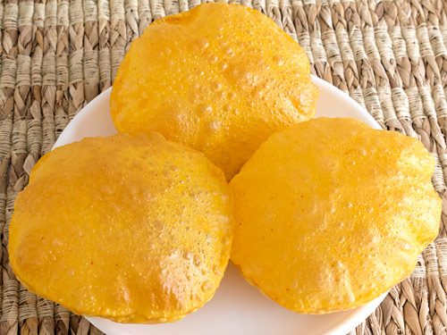

# Puris

*Puris are the celebratory cousin of the everyday roti: a tighter, richer wholemeal dough that puffs into hollow golden balloons in hot oil. They turn up at festivals, weddings and special meals across the Indian subcontinent, paired with a wet curry that fills the cavity as you tear in.*

**Makes:** 8 puris

**Prep Time:** 30 minutes

**Cook Time:** 5 minutes

## Overview
Deep-fried wholemeal flatbreads built on a tight, slightly drier dough than a roti so they hold their shape long enough to puff in the oil. Each disc puffs in seconds and stays crisp for a few minutes off the heat. Best served the moment they leave the pan, ideally with chole or another sauce-rich curry.

## Ingredients

### Dough
- 310 g (11 oz / generous 2 cups) wholemeal flour, plus extra for dusting
- ½ teaspoon salt
- 100 ml (3½ fl oz / scant ½ cup) water, plus more as needed

### Frying
- Vegetable oil, for deep frying (about 2.5 cm / 1 inch deep)

## Method

### Stage 1 – Make the dough
1. In a large bowl, combine the flour and salt and make a well in the centre.
1. Add a little water to the well and mix, then add the rest gradually (up to 100 ml) until a dough forms.

### Stage 2 – Knead and rest
1. Turn the dough onto a floured surface and knead for 5 minutes, until soft and smooth.
1. Cover with cling film and rest in the refrigerator for 15 minutes.

### Stage 3 – Shape
1. Divide the rested dough into 8 pieces and roll each into a ball.
1. Flatten each ball, dust with flour, and roll into a 2 mm (1/8 inch) thick disc.

### Stage 4 – Fry
1. Heat a wok over medium and add 2.5 cm (1 inch) of oil.
1. Test the oil with a breadcrumb; it should sizzle and brown briskly.
1. Fry the puris one at a time, 40-50 seconds per side, until puffed and golden.
1. Drain on paper towels and serve immediately.

## Notes
- **Tight dough:** Puris need a slightly drier, firmer dough than rotis; too wet and they'll absorb oil instead of puffing.
- **Even thickness:** Patches that are thinner than the rest will brown before the puri puffs; aim for a consistent 2 mm across the disc.
- **Keep them covered:** Once rolled, stack the puris between cling film so they don't dry out and skin over before they hit the oil.
- **Ghee for richness:** Frying in ghee instead of vegetable oil deepens the flavour considerably; reserve it for special occasions.

## Serving
Serve with: Chole (chickpea curry), aloo sabzi, or any sauce-heavy festive dish.
Garnish with: A squeeze of lemon or a scatter of fresh coriander just before serving.

## Storage
- Best eaten fresh; puris go chewy as they cool.
- Reheat briefly in hot oil or a hot oven if you must, though they never quite recover their first-puff lightness.
- The dough holds in the fridge overnight, but bring it back to room temperature before rolling.
