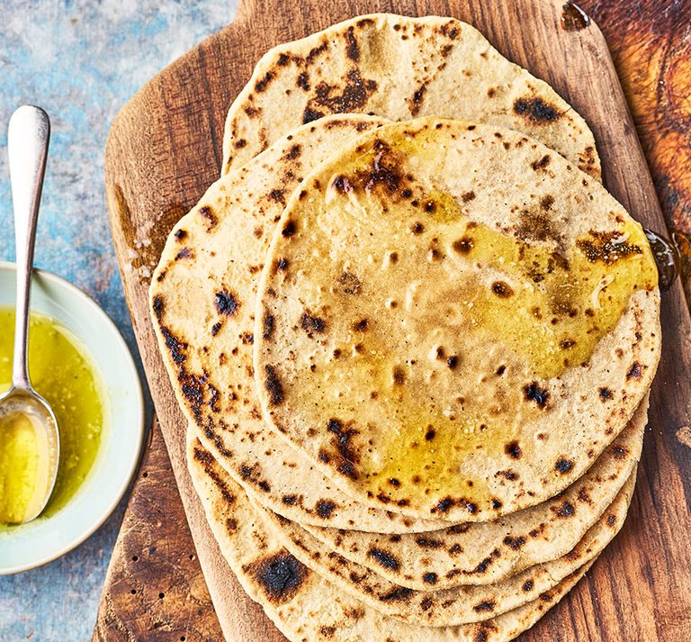

# Rotis

*Rotis are the daily bread of much of the Indian subcontinent: a plain, unleavened wholemeal flatbread cooked dry on a tawa and finished briefly over an open flame, where the trapped steam balloons the disc into the soft, layered round you tear pieces off at the table.*

**Makes:** 6-8 rotis

**Prep Time:** 30 minutes

**Cook Time:** 5 minutes

## Overview
A simple wholemeal flatbread that lives or dies on technique rather than ingredients. Rolled to even thinness and cooked first on a hot tawa, then puffed over a naked flame, a properly made roti separates into two thin sheets of soft bread. The right partner for almost any curry, dal or chutney.

## Ingredients

### Dough
- 380 g (13½ oz / 2½ cups) wholemeal flour
- ½ teaspoon salt
- 1 tablespoon vegetable oil
- 240 ml (8½ fl oz / 1 cup) water, or as needed

## Method

### Stage 1 – Make the dough
1. In a large bowl, combine the flour, salt and oil.
1. Add the water gradually while mixing until a soft dough forms.
1. Knead for 5 minutes, until smooth and elastic.
1. Cover with a damp cloth and rest for 15 minutes.

### Stage 2 – Shape
1. Divide the rested dough into ping-pong-sized balls.
1. Flatten each ball and dust with flour.
1. Roll into even circles, about 1-2 mm thick.

### Stage 3 – Cook
1. Heat a tawa or non-stick pan over medium-high heat.
1. Cook each roti for 30-45 seconds per side, until small light-brown spots appear.
1. Transfer with tongs to an open flame and puff briefly on each side.
1. Avoid burning; remove the moment the roti puffs and the flame catches.

## Notes
- **Even thickness:** The single most important variable; a thick patch traps steam unevenly and the roti won't puff cleanly.
- **Cast iron tawa:** A heavy tawa holds heat through the cool patches when a fresh disc lands; thinner pans dip in temperature and the roti steams instead of toasting.
- **Rest the dough:** A short 15-minute rest relaxes the gluten so the dough rolls thin without springing back; without it, the rotis end up oval and uneven.
- **Open-flame finish:** The flame stage is what gives the puff; without it the roti is still edible but flat and slightly tough.

## Serving
Serve with: Curries, dals or chutneys; brushed with ghee for extra richness.
Garnish with: A small knob of butter or ghee melted onto the hot roti just before serving.

## Storage
- Keep warm in a cloth-lined basket for up to an hour.
- Cooled rotis store in an airtight container for 1-2 days.
- Reheat on a hot pan for 30 seconds a side, or wrap and microwave briefly; the pan method preserves the texture better.
