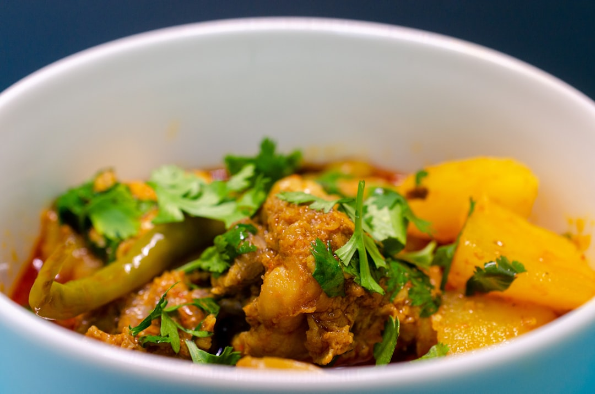

# Charsi Karahi

**Serves:** 4 or more as part of a multi-course meal

**Prep Time:** 5 minutes

**Cook Time:** 50 minutes

## Overview
A minimalist charsi karahi featuring tender lamb chunks cooked in their own fat with garlic, tomatoes, and chillies. No spices beyond kasoori methi,  the rich lamb fat and simple ingredients create an incredibly flavorful, moist curry perfect for naan.

## Ingredients
### Protein
- 900 g (2 lb) small chunks lamb or mutton on the bone
- 250 g (9 oz) lamb fat, cut into 2.5 cm (1 in) chunks

### Aromatics and veggies
- 2 tbsp garlic paste*
- 5 medium tomatoes, quartered
- 10 green bullet chillies or similar, cut lengthwise

### Base
- 2 tbsp rapeseed (canola) oil
- 1 litre (4½ cups) water (for garlic paste)

### Finishers
- Salt, to taste
- 1 tsp dried fenugreek leaves (kasoori methi)

## Method

### Stage 1 – Prepare garlic water
1. Whisk garlic paste into 1 litre water; set aside.

### Stage 2 – Brown lamb
1. Heat oil in a large karahi or wok over medium–high heat.
1. Add lamb meat and fat chunks; brown 5 minutes.

### Stage 3 – Simmer with garlic water
1. Add 250 ml (1 cup) garlic water; bring to rolling simmer.
1. As water reduces, add more gradually over 30 minutes, stirring regularly.
1. Reserve about 400 ml garlic water for later.

### Stage 4 – Add tomatoes and chillies
1. Place tomatoes on top; cover and simmer 10 minutes.
1. Smash tomatoes into meat with spoon.
1. Add green chillies and more garlic water if dry.

### Stage 5 – Finish simmering
1. Continue simmering until all water is used and lamb is fall-apart tender.
1. Oil will rise to top when ready; skim if desired.
1. Curry should be moist but not saucy.

### Stage 6 – Season and serve
1. Season with salt.
1. Rub kasoori methi between fingers and add to sauce.

## Notes
- Charsi karahi relies on lamb fat for flavor; not low-calorie.
- No spices used except kasoori methi for uniqueness.
- Adjust water to keep moist; lamb should be tender.

## Serving
- Serve with fresh naan to soak up sauce.
- Garnish with extra chillies and coriander.

## Storage
- Refrigerate 2–3 days in an airtight container.
- Freeze up to 2 months; thaw fully before reheating.
- Reheat gently on low heat with a splash of water.
- Best eaten within 24 hours for optimal tenderness.

*To make garlic paste, blend 2–4 cloves with enough water for smoothness.