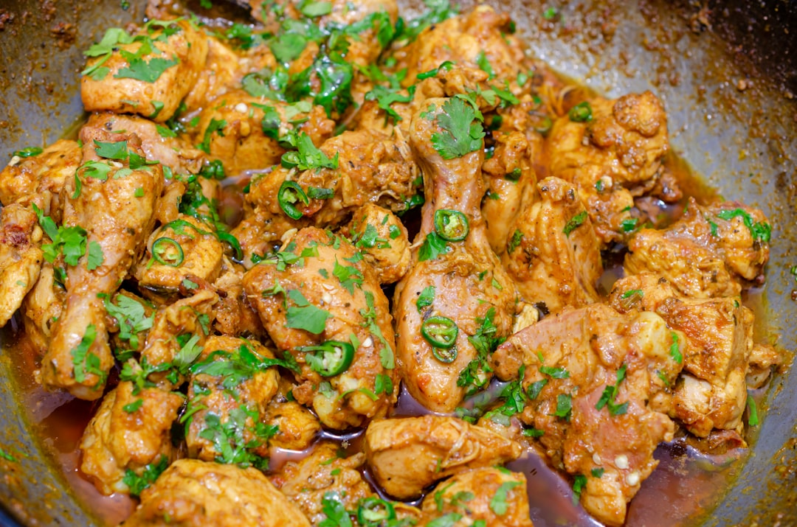

# Chicken Ceylon

**Serves:** 4 or more as part of a multi-course meal

**Prep Time:** 10 minutes

**Cook Time:** 10 minutes

## Overview
A bright and spicy Sri Lankan-inspired curry with a curry-house spin, featuring aromatic spices, coconut, and fresh curry leaves. It works beautifully as a banquet dish and can be extra hot with extra bird’s eye chillies and chilli powder. The subtle sweet-tang tuning makes it a favorite with rice and mild dhal.

## Ingredients
### Base
- 4 tbsp rapeseed (canola) oil or seasoned oil
- 2 star anise
- 7.5 cm (3 in) piece cinnamon stick or cassia bark
- 4 green cardamom pods, bashed
- 20 fresh or frozen curry leaves

### Aromatics and spice paste
- 2 tbsp garlic and ginger paste
- 2 green bird’s eye chillies, finely chopped
- 2 tbsp coconut flour
- 3 tbsp finely chopped coriander (cilantro) stalks
- 1 tsp Kashmiri chilli powder
- 2 tbsp mixed powder
- 1 tbsp tandoori masala
- ½ tbsp freshly ground black pepper
- 125 ml (½ cup) tomato purée

### Sauces and proteins
- 625 ml (2½ cups) base curry sauce (see quick and easy base curry sauce), heated
- 800 g (1 lb 12 oz) tandoori chicken tikka
- 125 ml (½ cup) spice stock or pre-cooked stewed chicken stock
- 100 g (3½ oz) block coconut, cut into small pieces

### Finishers
- 1 tsp dried fenugreek leaves (kasoori methi)
- 2 tbsp smooth mango chutney
- 1–2 tbsp raw cashew paste (optional)
- Salt, to taste
- Sugar, to taste
- Juice of 1 lime
- 1 tsp garam masala
- 3 tbsp chopped coriander (cilantro), to finish

## Method

### Stage 1 – Toast and infuse
1. Heat the oil in a large pan over medium–high heat until visibly hot.
1. Add star anise, cinnamon/cassia, and cardamom; stir for about 30 seconds until fragrant.
1. Add curry leaves and fry for another 30 seconds until aromatic.

### Stage 2 – Build flavour base
1. Add garlic and ginger paste and chopped chillies; cook 30 seconds.
1. Add coconut flour and mix for a few seconds.
1. Add coriander stalks, chilli powder, mixed powder, tandoori masala, black pepper, and tomato purée.

### Stage 3 – Add sauce and protein
1. Stir in 250 ml (1 cup) base curry sauce; reduce for approximately 1 minute, scraping caramelized bits from pan sides.
1. Add chicken, remaining base sauce, stock, and block coconut pieces.
1. Simmer about 5 minutes until sauce consistency is right, stirring occasionally.

### Stage 4 – Finish and adjust
1. Stir in dried fenugreek leaves, mango chutney, and optional cashew paste.
1. Remove whole spices if desired.
1. Add salt and sugar to taste.
1. Squeeze lime juice and sprinkle garam masala and chopped coriander before serving.

## Notes
- **Heat level:** Increase bird’s eye chillies and Kashmiri chilli powder for a spicier dish.
- **Coconut texture:** Avoid desiccated coconut to prevent grainy sauce.
- **Sauce consistency:** Adjust with more base curry sauce or stock if thin; reduce by simmering if thick.
- **Curry leaves:** Fresh or frozen leaves are best for authentic Sri Lankan aroma.

## Serving
Serve with: Steamed basmati rice, rotis, or naan
Garnish with: Fresh coriander, cucumber slices, and lime wedges
Accompaniment: Dhal and raita

## Storage
- Refrigerate 2-3 days in a sealed container
- Freeze up to 2 months; thaw overnight then reheat gently
- Reheat on low heat with a splash of water or stock
- Best eaten within 24 hours for brightest flavor