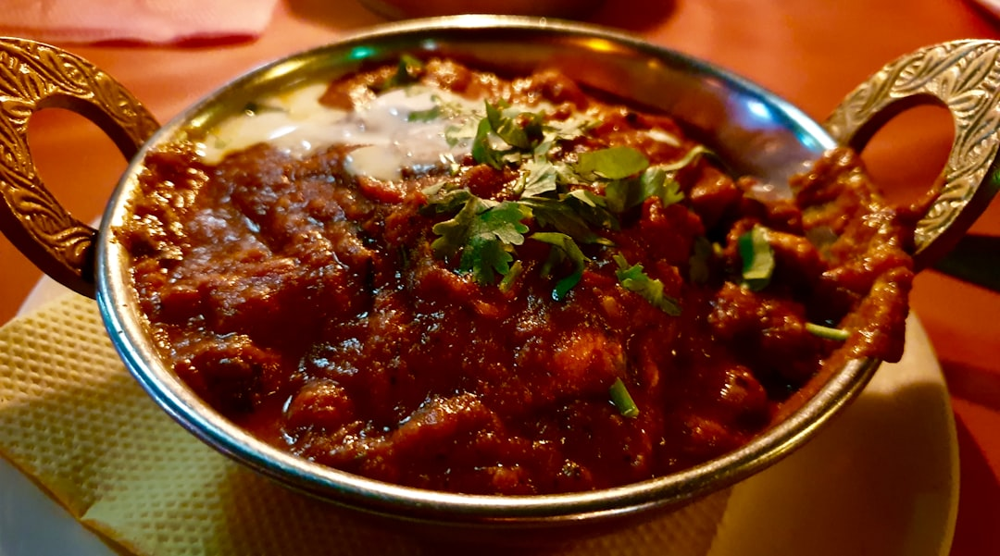

# Chicken Dhansak

**Serves:** 4 or more as part of a multi-course meal

**Prep Time:** 10 minutes

**Cook Time:** 10 minutes

## Overview
A British curry-house classic with sweet-sour notes of pineapple and lemon and earthy dhansak lentils. Inspired by Parsi dhansaks, this version uses red split lentils and pre-cooked chicken for convenience while keeping the iconic flavour profile.

## Ingredients
### Fat and aromatics
- 4 tbsp rapeseed (canola) oil or seasoned oil
- 2 tbsp garlic and ginger paste
- 1 tsp ground turmeric
- 2 tbsp mixed powder
- 1 tbsp chilli powder, or to taste
- 125 ml (½ cup) tomato purée

### Base sauce
- 500 ml (2 cups) base curry sauce (see quick and easy base curry sauce), heated
- 180 g (1 cup) red split lentils, rinsed and cooked until soft (e.g., tarka dhal)

### Protein and sweet-sour
- 800 g (1 lb 12 oz) pre-cooked stewed chicken, plus a splash of cooking stock or spice stock
- 115 ml (scant ½ cup) pineapple juice
- 3–4 canned pineapple rings, cut into pieces
- Salt, to taste
- Juice of 1–2 lemons, to taste

### Finish
- 3 tbsp chopped coriander (cilantro)

## Method

### Stage 1 – Start the sauce
1. Heat oil in a pan over medium–high.
1. Add garlic and ginger paste with turmeric; sizzle ~30 seconds until colour deepens.
1. Add mixed powder, chilli powder, and tomato purée; stir briskly.

### Stage 2 – Add base sauce and lentils
1. Add 250 ml (1 cup) base curry sauce and simmer 1 minute.
1. Stir in cooked lentils, reducing heat if they stick.

### Stage 3 – Add chicken and fruit
1. Add remaining base sauce, chicken, and stock splash.
1. Add pineapple juice and pineapple pieces.
1. Simmer 3–5 min until warmed and sauce is the desired thickness (add more sauce/stock if too thick).

### Stage 4 – Finish and serve
1. Season with salt and stir in lemon juice to taste.
1. Garnish with chopped coriander.

## Notes
- serving recommendation from original: brown rice and traditional vegetable mix (pumpkin, aubergine, potato).
- Keep a low simmer with lentils to prevent scorch.
- Adjust sweetness with more pineapple juice or sugar if needed.

## Serving
- Serve with steamed brown rice, naan, or roti.
- Garnish with extra coriander, a wedge of lemon, and optional fried onions.

## Storage
- Refrigerate 2–3 days in an airtight container.
- Freeze up to 2 months; thaw fully before reheating.
- Reheat gently on low heat with a splash of stock or water.
- Best eaten within 24 hours for best flavour.