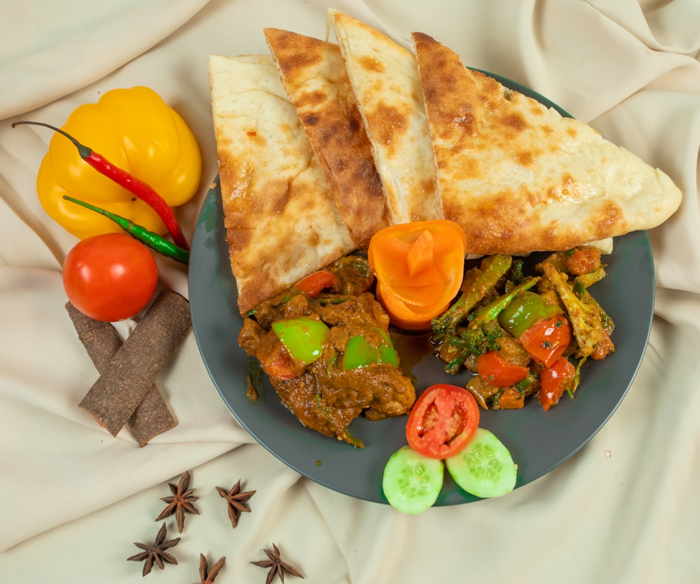

# Chicken Jalfrezi

**Serves:** 4 or more as part of a multi-course meal

**Prep Time:** 10 minutes

**Cook Time:** 10 minutes

## Overview
A curry-house jalfrezi inspired by a Balti House classic, featuring quick stir-fried peppers, chillies, onions and tender chicken in a light spiced sauce. It is traditionally dry and crisp, but can be adjusted for more sauce by adding extra base curry or stock.

## Ingredients
### Base and aromatics
- 4 tbsp rapeseed (canola) oil or seasoned oil
- 1 onion, thinly sliced
- 1 red bell pepper, deseeded and thinly sliced
- 3 green bird’s eye chillies, roughly chopped
- 2 tbsp finely chopped coriander (cilantro) stalks
- 2 tbsp garlic and ginger paste

### Spices and sauce
- 6 tbsp tomato purée
- 2 tbsp mixed powder
- 1 tsp chilli powder (optional)
- 500 ml (2 cups) base curry sauce, heated
- 700 g (1 lb 9 oz) pre-cooked stewed chicken, plus 100 ml (scant ½ cup) cooking stock
- 2 tomatoes, quartered

### Finishers
- 1 tsp dried fenugreek leaves (kasoori methi)
- Salt, to taste
- 1 tsp garam masala
- 2 tbsp chopped coriander (cilantro) leaves
- 2 green finger chillies, halved lengthwise

## Method

### Stage 1 – Sauté vegetables
1. Heat oil in a large frying pan over medium–high.
1. Add onion, red pepper, bird’s eye chillies, and coriander stalks.
1. Sauté until vegetables are tender-crisp.

### Stage 2 – Add aromatics and spices
1. Stir in garlic and ginger paste, cook 1 minute.
1. Add tomato purée, mixed powder, and chilli powder.
1. Add 250 ml (1 cup) base curry sauce and bring to boil.

### Stage 3 – Add chicken and simmer
1. Add chicken, stock, and remaining base curry sauce.
1. Simmer 5 minutes, stirring only if sticking.
1. Add more sauce/stock if too thick.

### Stage 4 – Final vegetables and seasoning
1. Add quartered tomatoes and kasoori methi 2 minutes before serving.
1. Cook until tomatoes are cooked through but still firm.
1. Season with salt and sprinkle garam masala.
1. Garnish with cilantro leaves and green chillies.

## Notes
- For a saucier curry, add extra base sauce or stock and simmer slightly longer.
- Use fresh, crisp vegetables and don’t overcook to retain jalfrezi texture.
- Increase chilli powder or additional bird’s eye chillies for heat.

## Serving
- Serve with steamed basmati rice, naan, or chapati.
- Garnish with fresh coriander and lemon wedges.

## Storage
- Refrigerate 2–3 days in airtight container.
- Freeze up to 2 months; thaw fully before reheating.
- Reheat gently with a splash of stock or water.
- Best eaten within 24 hours for best texture and flavours.