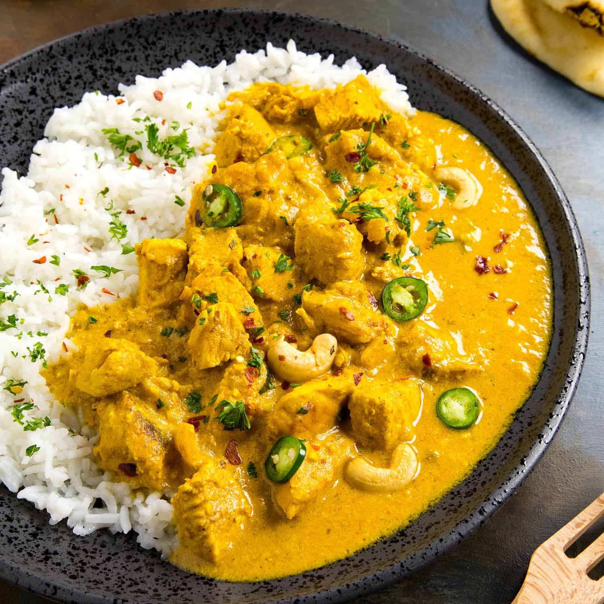

# Chicken korma

**Serves:** 4 or more as part of a multi-course meal

**Prep Time:** 10 minutes

**Cook Time:** 10 minutes

## Overview
A creamy, nutty British-Indian korma that uses both block coconut and coconut flour for depth and body. This curry is rich yet balanced, with mild heat and a hint of sweetness from sugar, banana and rose water. Serve with white rice and a mild dhal for the full experience.

## Ingredients
### Fat and whole spices
- 4 tbsp ghee, rapeseed (canola) oil or seasoned oil
- 2.5 cm (1 in) piece cinnamon stick or cassia bark
- 4 green cardamom pods, lightly bruised

### Aromatics and thickener
- 1 tsp garlic and ginger paste
- 3 tbsp sugar, or to taste
- 6 tbsp ground almonds
- 2 tbsp coconut flour

### Sauce and coconut
- 700 ml (3 cups) base curry sauce (see quick and easy base curry sauce), heated
- 100 g (3½ oz) block coconut

### Protein
- 800 g (1 lb 12 oz) raw chicken breast, cut on the diagonal into 5 mm (¼ in) slices, or pre-cooked stewed chicken

### Finishing
- 1 tbsp garam masala
- 125 ml (½ cup) single (light) cream, plus a little extra to finish
- 1 tbsp rose water, or to taste
- 2 tbsp cold butter (optional)
- Salt, to taste

## Method

### Stage 1 – Infuse the oil
1. Heat the ghee or oil in a large frying pan over medium heat.
1. Add cinnamon or cassia bark and cardamom pods; infuse for about 30 seconds.
1. Stir in garlic and ginger paste; fry for about 20 seconds.

### Stage 2 – Build korma base
1. Add sugar, ground almonds and coconut flour; stir to combine.
1. Add about 250 ml (1 cup) base curry sauce and bring to a simmer.
1. Break up the block coconut, add to sauce and allow it to dissolve.

### Stage 3 – Add chicken and simmer
1. Pour in remaining base curry sauce.
1. Add chicken and push pieces into sauce to cook quickly and evenly if raw.
1. Add garam masala and simmer until chicken is cooked through (about 10 minutes raw, 2 minutes pre-cooked).

### Stage 4 – Finish and balance
1. Remove cardamom pods and cinnamon.
1. Stir in cream, rose water, and butter (if using).
1. Season with salt, adjust sweetness with sugar if needed.

## Notes
- **Coconut texture:** Do not use desiccated coconut; it will make the sauce grainy.
- **Yellow colour:** Korma should be soft yellow; add food colouring powder for brighter restaurant-style color if desired.
- **Sauce consistency:** If too thick, add more base sauce or stock; if too thin, simmer to reduce.
- **Base sauce:** Making the base curry sauce in advance significantly cuts final cook time.

## Serving
Serve with: Steamed basmati rice, naan, and a mild dhal
Garnish with: Fresh coriander and optional toasted flaked almonds
Accompaniment: Raita and mango chutney

## Storage
- Refrigerate up to 2-3 days in an airtight container
- Freeze up to 2 months; thaw fully before reheating
- Reheat gently on low heat with a splash of water or stock
- Preferably consume within 24 hours for best texture and flavor