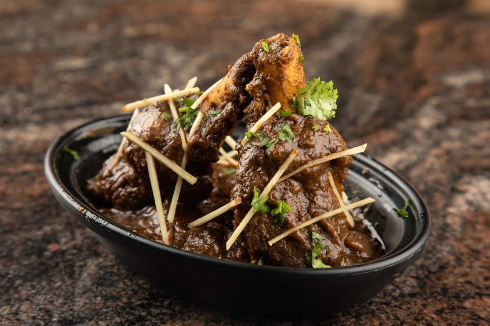

# Lamb Bhuna

**Serves:** 4 or more as part of a multi-course meal

**Prep Time:** 10 minutes

**Cook Time:** 10 minutes

## Overview
A restaurant-style bhuna using pre-cooked lamb for speed, while keeping the dry, intensely-flavoured finish. The classic bhuna technique is approximated with quick spice frying, and lamb is finished in a rich, reduced sauce.

## Ingredients
### Base
- 3 tbsp ghee, rapeseed (canola) oil or seasoned oil
- 1 small onion, finely chopped
- ¼ red bell pepper, deseeded and roughly chopped
- 2 tbsp garlic and ginger paste
- 2 tbsp finely chopped coriander stalks
- 125 ml (½ cup) tomato purée

### Spices
- 2 tbsp mixed powder
- 2 tbsp tandoori masala

### Sauce + protein
- 500 ml (2 cups) base curry sauce, heated
- 800 g (1 lb 12 oz) pre-cooked stewed lamb, plus 250 ml (1 cup) cooking stock (or extra base sauce)

### Finishing
- 2 tbsp Greek yoghurt
- Salt and freshly ground black pepper, to taste
- Small bunch coriander leaves, finely chopped
- Juice of 1–2 limes (optional)
- Sliced red chilli (optional)

## Method

### Stage 1 – Fry onion and pepper
1. Heat ghee/oil in a large pan over medium–high heat.
1. Add onion and red pepper; cook 5 minutes until onion is soft and translucent.
1. Add garlic and ginger paste and coriander stalks; cook 30 seconds.

### Stage 2 – Add spices and base sauce
1. Stir in tomato purée, bring to a simmer.
1. Add mixed powder and tandoori masala, mix well.
1. Add 250 ml (1 cup) base sauce; simmer 2 minutes, scraping caramelized edges.

### Stage 3 – Add lamb and reduce
1. Increase heat to high; add lamb, remaining base sauce and stock.
1. Bubble until sauce reduces thicken and coats lamb.

### Stage 4 – Finish with yoghurt and herbs
1. Reduce heat to medium, whisk in yoghurt 1 tbsp at a time.
1. Season with salt and pepper.
1. Stir through chopped coriander.
1. Serve with lime juice and sliced chilli, if desired.

## Notes
- For authentic bhuna, use small bone-in lamb pieces and long slow cooking with stock (not in this quick version).
- Adjust thickness with extra base sauce or stock if too dry.
- If desired, swap lamb for chicken using the same steps for lighter texture.

## Serving
- Serve with naan, chapati, or basmati rice.
- Garnish with fresh coriander and lime wedges.

## Storage
- Refrigerate 2–3 days in an airtight container.
- Freeze up to 2 months; thaw fully before reheating.
- Reheat gently over low heat with a splash of stock or water.
- Best eaten within 24 hours for the richest flavour.