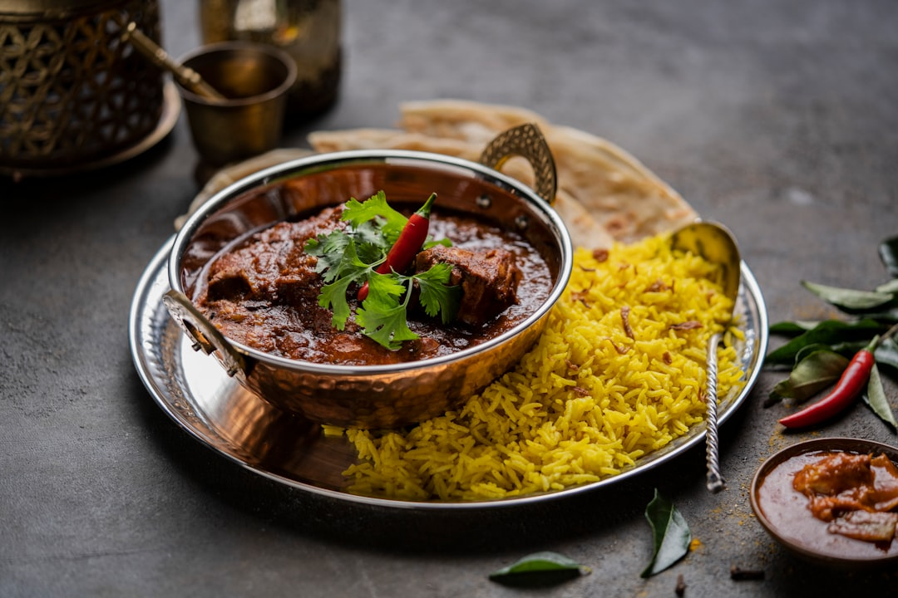

# Lamb Madras

**Serves:** 4 or more as part of a multi-course meal

**Prep Time:** 10 minutes

**Cook Time:** 10 minutes

## Overview
A classic British curry-house madras with a sweet-and-sour profile, featuring tender lamb in a spicy, tangy sauce. This version balances heat from chillies and chilli powder with mango chutney and lime for a feast-worthy dish.

## Ingredients
### Base
- 3 tbsp rapeseed (canola) oil or seasoned oil
- 2–4 Kashmiri dried red chillies, to taste
- A few green cardamom pods, lightly bruised

### Aromatics and spices
- 3 tbsp garlic and ginger paste
- 2 fresh green chillies, or to taste, finely chopped
- 125 ml (½ cup) tomato purée
- 2 tbsp ground cumin
- 1 tsp ground coriander
- ¼ tsp ground turmeric
- 1–2 tbsp chilli powder, to taste
- 2 tbsp mixed powder

### Sauce and protein
- 500 ml (2 cups) base curry sauce, heated
- 800 g (1 lb 12 oz) pre-cooked stewed lamb, plus 250 ml (1 cup) cooking stock, or extra base curry sauce

### Finishers
- 1–2 tbsp smooth mango chutney, to taste
- Juice of 1 lime
- Salt, to taste
- Pinch of garam masala
- Coriander (cilantro), to garnish

## Method

### Stage 1 – Temper spices
1. Heat oil in a pan over medium–high heat.
1. Add dried chillies and cardamom pods; sizzle 30 seconds.
1. Add garlic and ginger paste with chopped chillies; sizzle 20 seconds.

### Stage 2 – Build spice base
1. Stir in tomato purée, cumin, coriander, turmeric, chilli powder, and mixed powder.

### Stage 3 – Add sauce and lamb
1. Add 250 ml (1 cup) base curry sauce and lamb; simmer 2 minutes, scraping caramelized bits.
1. Add remaining base sauce and stock; simmer until reduced to desired consistency.

### Stage 4 – Finish
1. Stir in mango chutney and lime juice.
1. Season with salt, sprinkle garam masala, and garnish with coriander.

## Notes
- Madras is traditionally spicier than milder curries; adjust chillies and chilli powder to taste.
- For a more savoury twist, substitute spicy lime pickle for mango chutney.
- Remove whole spices like cardamom if preferred.

## Serving
- Serve with steamed basmati rice, naan, or chapati.
- Accompany with kachumber salad and raita.

## Storage
- Refrigerate 2–3 days in an airtight container.
- Freeze up to 2 months; thaw fully before reheating.
- Reheat gently on low heat with a splash of stock or water.
- Best eaten within 24 hours for peak flavour.