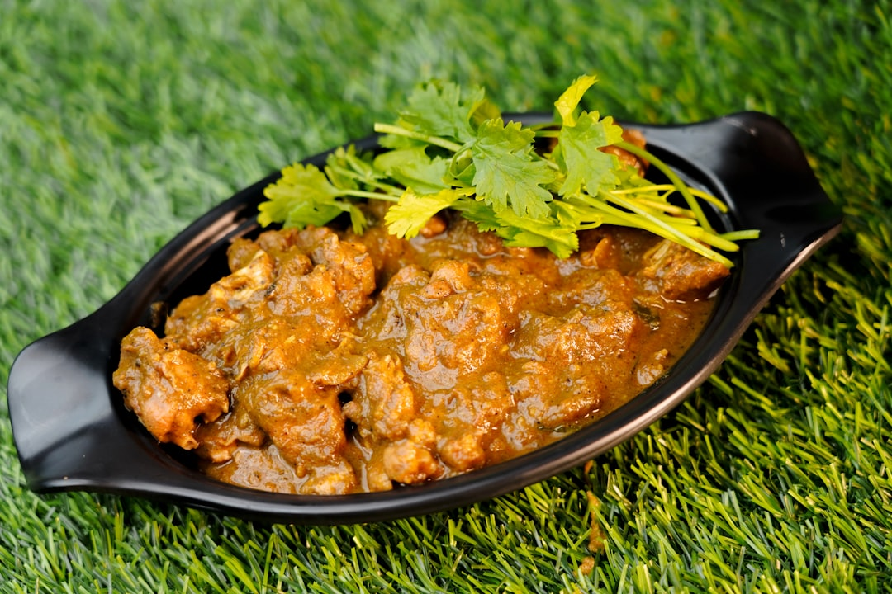

# Lamb Saag

**Serves:** 4 or more as part of a multi-course meal

**Prep Time:** 10 minutes

**Cook Time:** 10 minutes

## Overview
A quick British curry-house version of classic Punjabi saag gosht, combining pre-cooked lamb and bright spinach puree for a rich, green sauce. Similar to slow-cook authentic versions, this recipe delivers deep, buttery flavour in a fraction of the time.

## Ingredients
### Spinach puree
- 225 g (8 oz) baby spinach leaves
- A little water or spice stock
- 3–6 fresh green bullet chillies, to taste
- Bunch coriander leaves (cilantro), leaves only

### Aromatics and spices
- 4 tbsp ghee, rapeseed (canola) oil or seasoned oil
- 1 onion, finely chopped
- 2 tbsp garlic paste and 1 tbsp ginger paste*, or 3 tbsp garlic and ginger paste
- 3 tbsp finely chopped coriander stalks
- 1 tbsp ground cumin
- 1 tbsp ground coriander
- 1 tbsp mixed powder
- 1 tsp chilli powder
- 180 ml (¾ cup) tomato purée

### Sauce and protein
- 375 ml (generous 1½ cups) base curry sauce, heated
- 600 g (1 lb 5 oz) pre-cooked stewed lamb, plus 250 ml (1 cup) cooking stock

### Finishers
- 2 tbsp plain yoghurt
- Juice of 1 lemon
- 1 tbsp garam masala

## Method

### Stage 1 – Make spinach paste
1. Blend spinach, chillies, and coriander leaves with water/spice stock to a smooth paste. Set aside.

### Stage 2 – Fry onions and spices
1. Heat ghee/oil in a frying pan over medium–high.
1. Add onion and fry 5 minutes until translucent.
1. Add garlic and ginger paste; sizzle 30 seconds.
1. Add coriander stalks, cumin, ground coriander, mixed powder, and chilli powder; stir.

### Stage 3 – Build curry base
1. Add tomato purée, then 250 ml (1 cup) base curry sauce; simmer.
1. Add remaining base sauce and stock; simmer briefly, stirring in any caramelized edges.

### Stage 4 – Add lamb and spinach
1. Add lamb and heat through.
1. Add spinach puree and simmer 2 minutes (colour deepens).
1. Adjust thickness with more base sauce/stock if needed.

### Stage 5 – Finish
1. Season with salt and pepper.
1. Whisk in yoghurt 1 tbsp at a time.
1. Add lemon juice and garam masala.

## Notes
- Serves well with plain or pilau rice.
- Add chickpeas or potatoes for extra texture.
- Use ghee for additional richness.

## Serving
- Serve hot with naan, chapati, or rice.
- Garnish with fresh coriander and a chili slice.

## Storage
- Refrigerate 2–3 days in an airtight container.
- Freeze up to 2 months; thaw fully before reheating.
- Reheat gently with a splash of stock or water.
- Best eaten within 24 hours for best flavour.

## Other ideas
- Chickpeas or pre-cooked potatoes can be added for more substance.

*To make fresh garlic paste, blend 2–4 cloves with enough water. For ginger paste, blend a 5 cm (2 in) piece of ginger with water.