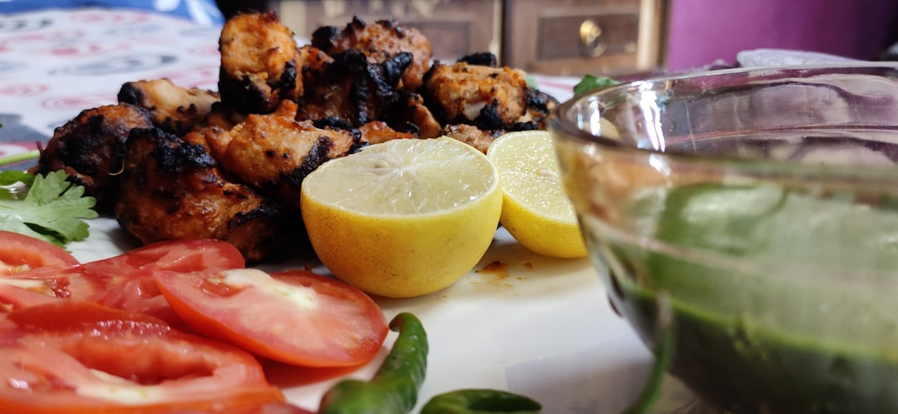

# Tandoori Methi Chicken Tikka

**Serves:** 4 or more as part of a multi-course meal

**Prep Time:** 15 minutes

**Cook Time:** 10 minutes

## Overview
A flavorful methi chicken tikka combining fresh fenugreek with aromatic spices and yoghurt marinade. This recipe blends elements from various traditional preparations, resulting in a barbecue favorite with charred edges and tender, juicy meat.

## Ingredients
### Protein
- 800 g (1 lb 12 oz) skinless chicken thighs or breasts, cut into 7.5 cm (3 in) pieces

### Marinade
- 2 large bunches (about 100 g/3½ oz) fresh fenugreek leaves*
- 3 tbsp rapeseed (canola) oil or mustard oil
- 1 tbsp cumin seeds
- 250 g (1 cup) Greek yoghurt
- 2 tbsp garlic and ginger paste (total, including initial rub)
- 5 tbsp finely chopped coriander (cilantro) leaves
- 1 tbsp green chilli paste
- 1 tbsp red chilli powder
- 1 tbsp garam masala
- 1 tbsp gram (chickpea) flour
- 3 tbsp cream cheese
- 1 tbsp rapeseed (canola) oil

### Aromatics and acid
- Juice of 2 lemons

### Finishers
- 50 g (3½ tbsp) unsalted butter, melted
- Salt, to taste

## Method

### Stage 1 – Prepare chicken
1. Squeeze lemon juice over chicken; rub in 1 tbsp garlic and ginger paste.
1. Set aside while preparing marinade.

### Stage 2 – Prepare fenugreek
1. Finely chop fresh fenugreek leaves and thin stalks.
1. Blanch in boiling water 30 seconds; drain and squeeze out excess moisture.
1. Blend to smooth purée in food processor (add water if needed); set aside.

### Stage 3 – Cook fenugreek base
1. Heat oil in large frying pan over medium–high heat until hot.
1. Add cumin seeds; when popping, add fenugreek purée.
1. Stir-fry 30 seconds; set aside to cool.

### Stage 4 – Make marinade
1. Whisk yoghurt in large bowl until smooth.
1. Add remaining garlic-ginger paste, coriander, chilli paste, red chilli powder, garam masala, gram flour, cream cheese, and rapeseed oil.
1. Work together by hand to smooth emulsion.
1. Add cooled fenugreek mixture; work into smooth marinade.

### Stage 5 – Marinate chicken
1. Add chicken to marinade; cover and marinate 3–24 hours.

### Stage 6 – Cook chicken
1. Light charcoal barbecue (two shoeboxes full) until white-hot.
1. Skewer chicken with space between pieces.
1. Grill one side until charred; flip and cook through (~10 mins total).
1. Baste with melted butter just before done.
1. Rest 5 mins; season with salt.

## Notes
- Fresh fenugreek is best, but see chicken methi curry for dried or alternative ingredients.
- Can roast in oven at 200°C (400°F/Gas 6) until cooked, then grill for char.
- Mustard oil adds nutty aroma if available.

## Serving
- Serve with raita and naan breads.
- Garnish with extra coriander and lemon wedges.

## Storage
- Marinated chicken refrigerates 24 hours.
- Cooked tikka refrigerates 2 days in airtight container.
- Freeze uncooked marinated chicken up to 1 month; thaw before cooking.
- Reheat gently in oven; best fresh off grill.