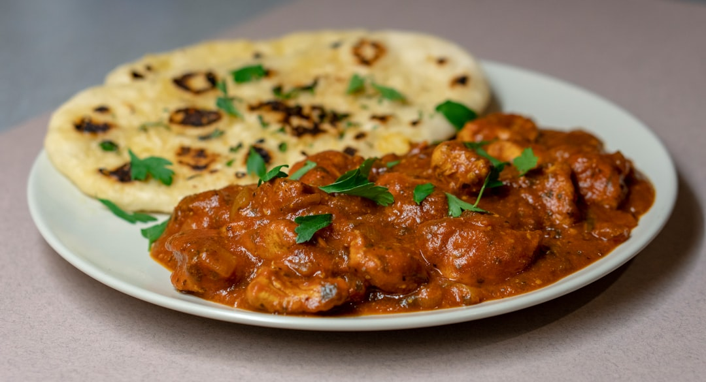

# Chicken Chasni

**Serves:** 4 or more as part of a multi-course meal

**Prep Time:** 10 minutes

**Cook Time:** 10 minutes

## Overview
A sweet and smooth British-Indian chasni that pairs best with tandoori chicken tikka. Balanced mango chutney, mint sauce, and tomato ketchup give this curry bright sweetness and tang, while cream and optional red colouring deliver the signature rich appearance.

## Ingredients
### Fat and aromatics
- 3 tbsp ghee or rapeseed (canola) oil or seasoned oil
- 2 tbsp garlic and ginger paste
- ½ tsp ground turmeric

### Sauce and chicken
- 500 ml (2 cups) base curry sauce (see quick and easy base curry sauce), heated
- 800 g (1 lb 12 oz) pre-cooked stewed chicken, plus 125 ml (½ cup) cooking stock, or extra base curry sauce

### Flavourings and finishers
- 3 tbsp smooth mango chutney
- 2 tbsp mint sauce
- 3 tbsp tomato ketchup
- 1 tbsp ground cumin
- 200 ml (generous ¾ cup) double (heavy) cream
- Salt, to taste
- Juice of 1–2 lemons, to taste
- Bright red food colouring powder (optional)
- ½ tsp garam masala
- 3 tbsp very finely chopped coriander (cilantro)

## Method

### Stage 1 – Fry aromatics
1. Heat ghee/oil in a large pan over medium–high heat.
1. Add garlic and ginger paste; let sizzle.
1. Add turmeric and fry for about 40 seconds, stirring continuously.

### Stage 2 – Build chasni base
1. Add 250 ml (1 cup) base curry sauce and bring to rapid simmer.
1. Scrape caramelized bits from pan sides into sauce.

### Stage 3 – Add chicken and simmer
1. Add remaining base sauce, pre-cooked chicken, and stock/extra sauce.
1. Cook about 5 minutes, stirring only if sticking.

### Stage 4 – Finish flavours
1. Add mango chutney, mint sauce, ketchup, and cumin; stir well.
1. Pour in cream and simmer until hot.
1. Season with salt and lemon juice.
1. If desired, stir in bright red food colouring for traditional color.
1. Sprinkle with garam masala and chopped coriander, then serve.

## Notes
- Chasni is traditionally sweeter than other curries; adjust ketchup/mango chutney to preferences.
- For truthful restaurant-style colour, a pinch of red food coloring may be used, but it is optional.
- If sauce is too thick, add extra stock or base curry sauce; if too thin, simmer briefly to reduce.

## Serving
Serve with steamed basmati rice, naan, or parathas. Garnish with extra fresh coriander and lime wedges.

## Storage
- Refrigerate 2–3 days in an airtight container
- Freeze up to 2 months; thaw fully before reheating
- Reheat gently on low heat with a splash of water or stock
- Best eaten within 24 hours for brightest flavour