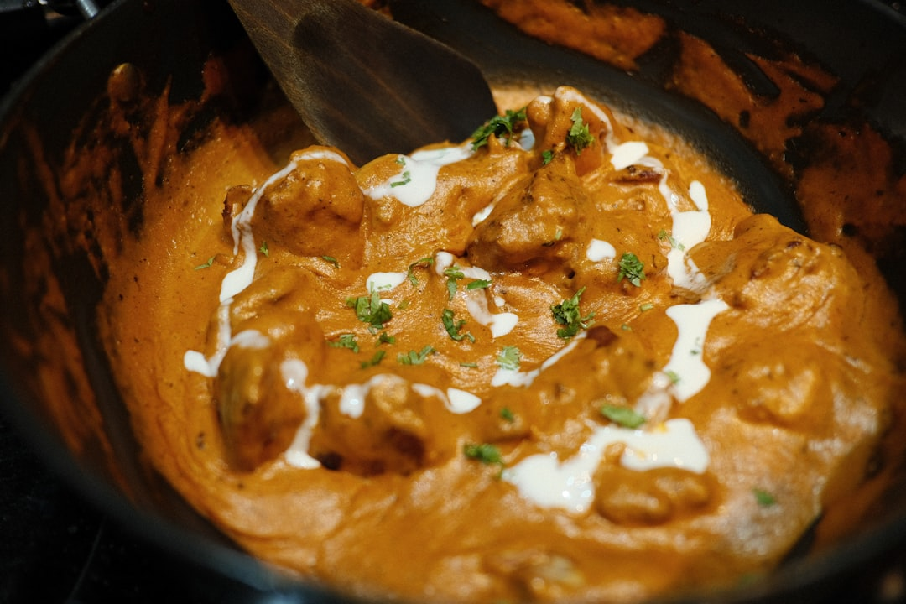

# Chicken curry

**Serves:** 4 or more as part of a multi-course meal

**Prep Time:** 10 minutes

**Cook Time:** 25 minutes

## Overview
A curry-house style chicken curry that builds flavor from whole spices and fresh aromatics rather than premade base sauces. The method takes a little more time, but rewards you with a rich, home-style curry sauce and tender chicken. Add extra chilli or more garam masala to increase heat for your preference.

## Ingredients
### Spice base
- 3 tbsp rapeseed (canola) oil
- 2.5 cm (1 in) piece cinnamon stick
- Seeds from 3 green cardamom pods
- 2 star anise
- 1 tsp cumin seeds

### Aromatics
- 2 onions, finely chopped
- 2 tbsp garlic and ginger paste

### Sauce and seasoning
- 125 ml (½ cup) tomato purée or plain passata
- 2 tbsp mixed powder or curry powder
- 2 tsp ground cumin
- 2 tsp ground coriander
- ½ tsp ground turmeric
- 1–2 tbsp paprika
- ½ tsp garam masala
- 2 medium tomatoes, diced

### Protein
- 900 g (2 lb) chicken thighs or breast, cut into bite-size pieces

### Finish
- Pinch dried fenugreek leaves (kasoori methi)
- Salt, to taste
- 3 tbsp melted ghee (optional)
- 2 tbsp finely chopped coriander (cilantro), to garnish

## Method

### Stage 1 – Toast spices and onions
1. Heat oil over medium–high heat in a large frying pan.
1. Add cinnamon stick, cardamom seeds, star anise and cumin seeds; stir for about 30 seconds.
1. Add onions and fry for about 5 minutes until soft and translucent.
1. Add garlic and ginger paste and fry for 30 seconds.

### Stage 2 – Build sauce
1. Stir in tomato purée and bring to simmer.
1. Add 250 ml (1 cup) water and simmer until nearly evaporated; this helps break down onions.
1. Add curry powder, ground cumin, coriander, turmeric, paprika, and diced tomatoes; stir to combine.
1. Add another 250 ml (1 cup) water and simmer until nearly evaporated, forming a thick sauce.

### Stage 3 – Cook chicken
1. Add chicken pieces, coat in sauce, cover, and simmer for about 10 minutes until cooked through.
1. Stir occasionally; adjust with extra water if too thick.
1. Remove lid; sauce should be thick with onions integrating into it.

### Stage 4 – Finish and garnish
1. Rub dried fenugreek leaves between fingers into sauce and season with salt.
1. Stir in melted ghee if using for richness.
1. Garnish with chopped coriander and serve hot.

## Notes
- **No base sauce:** This recipe demonstrates how to develop curry-house flavor from scratch using whole and ground spices.
- **Thickness control:** Add additional water gradually until desired sauce consistency is reached.
- **Spice adjustments:** Increase chillies, paprika, or garam masala for more heat.
- **Meat alternatives:** Lamb or paneer can be substituted using similar steps and cooking time adjustments.

## Serving
Serve with: Steamed basmati rice, naan, and a side of raita or pickled onions.
Garnish with: Fresh coriander and optional lemon wedges.

## Storage
- Keeps 2-3 days refrigerated in an airtight container.
- Freezes well up to 2 months; thaw overnight in refrigerator and reheat gently.
- Reheat on low heat with a splash of water and stir until warmed through.
