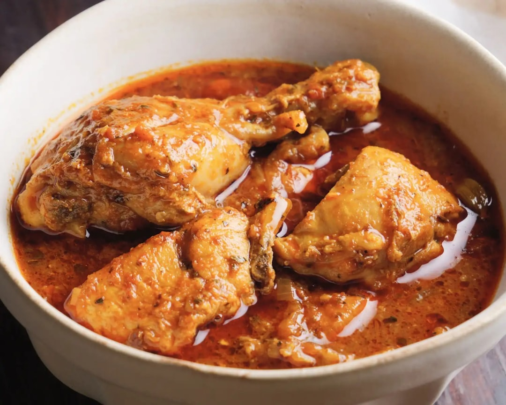

# Chicken Dopiaza

**Serves:** 4 or more as part of a multi-course meal

**Prep Time:** 10 minutes

**Cook Time:** 10 minutes

## Overview
A vibrant do-piaza curry based on layered onion textures and warming spices. This version uses both seared onion petals and a yoghurt-onion paste to build depth; the result is a rich, savoury, mildly tangy curry that works with pre-cooked stewed chicken or freshly poached chicken.

## Ingredients
### Fat and whole spices
- 4 tbsp rapeseed (canola) oil or seasoned oil
- 6 green cardamom pods, bashed
- 1 tsp cumin seeds
- 1 tsp coriander seeds, roughly chopped

### Onions and aromatics
- 1 small onion, quartered and divided into petals
- 3 tbsp garlic and ginger paste
- 2 tbsp mixed powder
- 1 tsp ground cumin
- 1–2 tsp mild or hot chilli powder, to taste
- 125 ml (½ cup) tomato purée

### Sauce and chicken
- 500 ml (2 cups) base curry sauce (see quick and easy base curry sauce), heated
- 600 g (1 lb 5 oz) pre-cooked stewed chicken, plus 250 ml (1 cup) of its cooking stock, or extra base curry sauce

### Finishers
- 7 tbsp onion paste made with yoghurt
- 1 tsp dried fenugreek leaves (kasoori methi)
- Salt, to taste
- 1 tsp garam masala
- Small bunch coriander (cilantro), chopped
- 2 handfuls fried onions

## Method

### Stage 1 – Char onion petals
1. Heat 1 tbsp oil in a large pan over high heat.
1. Add onion petals and sear until charred on the edges but still slightly crisp.
1. Remove with a slotted spoon and set aside.

### Stage 2 – Infuse spices
1. Reduce heat to medium–high and add remaining oil.
1. When shimmering, add cardamom, cumin seeds, and coriander seeds.
1. Stir for 30 seconds until fragrant.

### Stage 3 – Build sauce
1. Add garlic and ginger paste; sizzle until aromatic.
1. Stir in mixed powder, ground cumin, chilli powder, and tomato purée.
1. Add 250 ml (1 cup) base curry sauce; bring to simmer.
1. Add remaining base sauce plus reserved chicken stock (or extra base curry sauce), and simmer, stirring as needed.

### Stage 4 – Add chicken and top up
1. Add pre-cooked chicken; simmer 2 minutes until warmed through.
1. Adjust consistency: add more stock / base sauce if too thick.

### Stage 5 – Finish and garnish
1. Stir onion-yoghurt paste in, 1 tbsp at a time.
1. Add dried fenugreek leaves and charred onion petals.
1. Season with salt.
1. Remove from heat and sprinkle with coriander, fried onions, and garam masala.

## Notes
- **Do-piaza meaning:** traditionally “two onions” but here we use multiple onion techniques for richer texture.
- **Heat:** adjust chilli powder to taste; add extra for kick.
- **Consistency:** classic do-piaza is moderately thick; add stock/sauce to loosen as needed.

## Serving
Serve with steamed basmati rice, parathas, or naan. Garnish with extra coriander and lime wedges if desired.

## Storage
- Refrigerate 2–3 days in an airtight container
- Freeze up to 2 months; thaw fully before reheating
- Reheat gently on low heat with a splash of water or stock
- Best eaten within 24 hours for freshest flavor