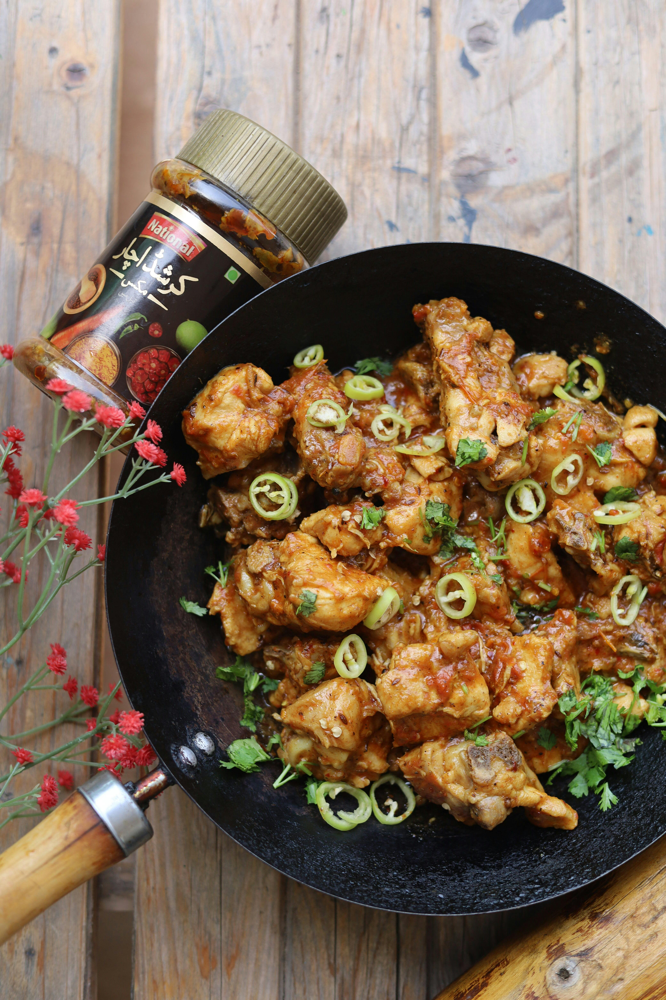

# Kashmiri chicken

**Serves:** 4 or more as part of a multi-course meal

**Prep Time:** 10 minutes

**Cook Time:** 10 minutes

## Overview
An aromatic curry-house classic that blends tandoori chicken with a sweet-spicy sauce of nuts, spices, banana and mango chutney. This dish is cooked quickly once the base sauce is ready, making it ideal for a flavorful weeknight meal or part of a banquet. Raisins add a pleasant sweetness and balance to the heat.

## Ingredients
### Spice base
- 3 tbsp melted ghee or rapeseed (canola) oil
- 2.5 cm (1 in) piece cinnamon stick
- Seeds from 3 green cardamom pods
- 2 cloves

### Aromatics and base
- 1 small onion, very finely chopped
- 1 tbsp garlic and ginger paste
- 2 tbsp ground almonds
- ½ green bell pepper, thinly sliced

### Curry seasoning
- 1½ tsp mixed powder or curry powder
- ½ tsp Kashmiri chilli powder
- 70 ml (¼ cup) tomato purée
- 500 ml (2 cups) base curry sauce (quick and easy base sauce), heated
- 1 tsp tamarind concentrate

### Protein and finish
- 700 g (1 lb 9 oz) tandoori chicken tikka
- ½ banana, sliced into coins
- 2 tbsp raisins (optional)
- 2 tsp smooth mango chutney
- 3 tbsp plain yoghurt
- Salt, to taste
- Coriander (cilantro), to garnish

## Method

### Stage 1 – Temper Spices and Build Base
1. Heat the oil in a large frying pan over medium–high heat.
1. Add cinnamon stick, cardamom seeds and cloves; infuse for about 30 seconds.
1. Add onion and fry for about 5 minutes until soft and translucent.
1. Stir in garlic and ginger paste plus ground almonds; simmer for about 30 seconds.
1. Add bell pepper and cook for 1 minute.

### Stage 2 – Add Spices and Sauce
1. Add mixed powder and Kashmiri chilli powder; stir to combine.
1. Add tomato purée and half the base curry sauce; bring to a simmer.
1. Stir in tamarind concentrate and simmer, adding more base sauce as needed.
1. Scrape caramelized bits from pan sides into the sauce for extra flavor.

### Stage 3 – Add Chicken and Finish
1. Stir in tandoori chicken tikka; cook until heated through (about 2 minutes).
1. Add banana coins, raisins (if using), and mango chutney; simmer until desired consistency.
1. If too thick, add additional base sauce or stock; if too thin, simmer until reduced.
1. Whisk in yoghurt, 1 tablespoon at a time.
1. Season with salt and garnish with coriander.

## Notes
- **Base sauce:** Prepare a quick base curry sauce ahead to keep cooking time very short.
- **Mango chutney:** Use smooth chutney for texture; chunky chutney changes mouthfeel.
- **Sweet balance:** Banana and raisins bring sweetness; adjust according to taste.
- **Spice heat:** Increase Kashmiri chilli powder or add fresh chillies for more heat.

## Serving
Serve with: Basmati rice, naan, or paratha
Garnish with: Fresh coriander and optional toasted flaked almonds
Accompaniment: Raita or pickled onions

## Storage
- Refrigerate up to 2-3 days in an airtight container.
- Freeze up to 2 months; thaw overnight and reheat gently.
- Reheat on low with a splash of water or stock to restore sauce consistency.