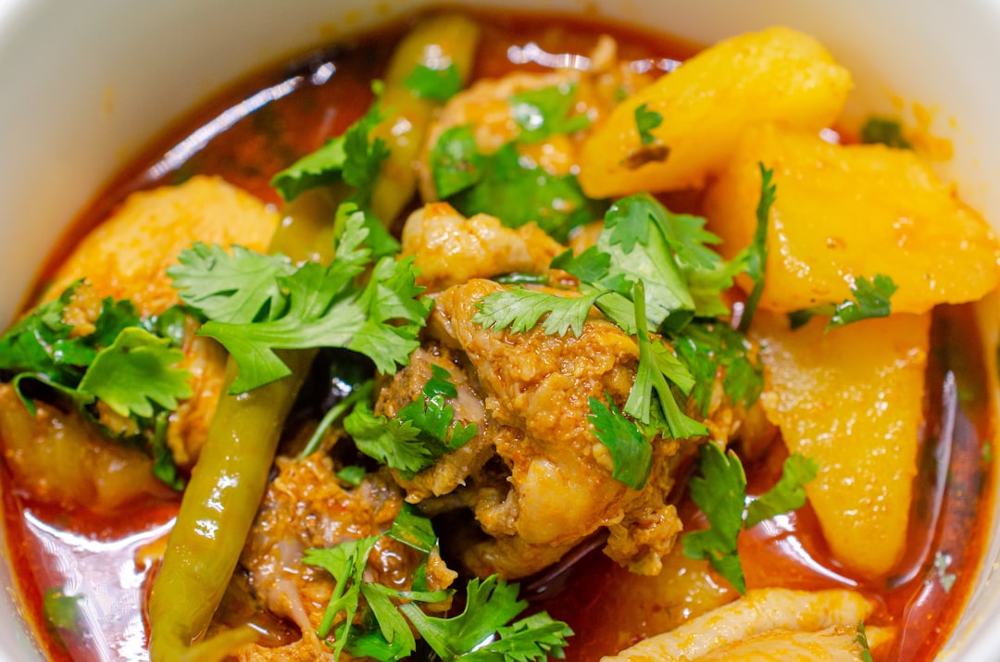

# Mango Chicken Curry

**Serves:** 4 or more as part of a multi-course meal

**Prep Time:** 10 minutes

**Cook Time:** 15 minutes

## Overview
A sweet-spicy BIR-style mango chicken curry with plenty of tropical fruit brightness and mild curry-house heat. This recipe blends the pineapple-style sweetness of mango chutney and fruit chunks with a rich coconut-spiced base and tender chicken.

## Ingredients
### Base
- 2 tbsp rapeseed (canola) oil
- 2 tbsp garlic and ginger paste
- 1 tbsp mixed powder or curry powder
- 1 tsp chilli powder (or to taste)
- 3 tbsp finely chopped coriander stalks
- 2 fresh green chillies (bird’s eye or bullet), thinly sliced

### Sauce and sweeteners
- 600 ml (2½ cups) base curry sauce, heated (plus extra if needed)
- 6 tbsp coconut flour
- 4 tbsp smooth mango chutney

### Protein and fruit
- 700 g (1 lb 9 oz) pre-cooked chicken
- 1 small mango, cut into bite-size chunks (or canned mango)

### Finishers
- Salt, to taste
- 1 tsp garam masala
- 1 tsp dried fenugreek leaves (kasoori methi)
- 3 tbsp finely chopped coriander leaves

## Method

### Stage 1 – Sauté aromatics
1. Heat oil in frying pan over medium–high heat.
1. Add garlic-ginger paste and fry ~30 sec.
1. Add mixed powder, chilli powder, coriander stalks, and green chillies; stir well.

### Stage 2 – Add sauce
1. Add 250 ml (1 cup) base sauce; bring to rolling simmer.
1. Add coconut flour and mango chutney, then 125 ml (½ cup) base sauce.

### Stage 3 – Add chicken and mango
1. Stir in chicken and heat ~1 min.
1. Add mango chunks and remaining base sauce.
1. Simmer 4 min until slightly reduced (add extra sauce or water if too thick).

### Stage 4 – Finish
1. Season with salt.
1. Sprinkle garam masala and kasoori methi; stir.
1. Garnish with chopped coriander.

## Notes
- Adjust chilli to suit kids: reduce green chillies and chilli powder.
- Use ripe mango for sweetness; canned mango works well in off-season.
- Add extra base sauce or stock if sauce tightens too much.

## Serving
- Serve with steamed basmati rice or naan.
- Garnish with extra coriander and fresh chilli rings.

## Storage
- Refrigerate 2–3 days in an airtight container.
- Freeze up to 2 months; thaw fully before reheating.
- Reheat gently on low heat with splashes of stock or water.
- Best eaten within 24 hours for brightest mango flavor.