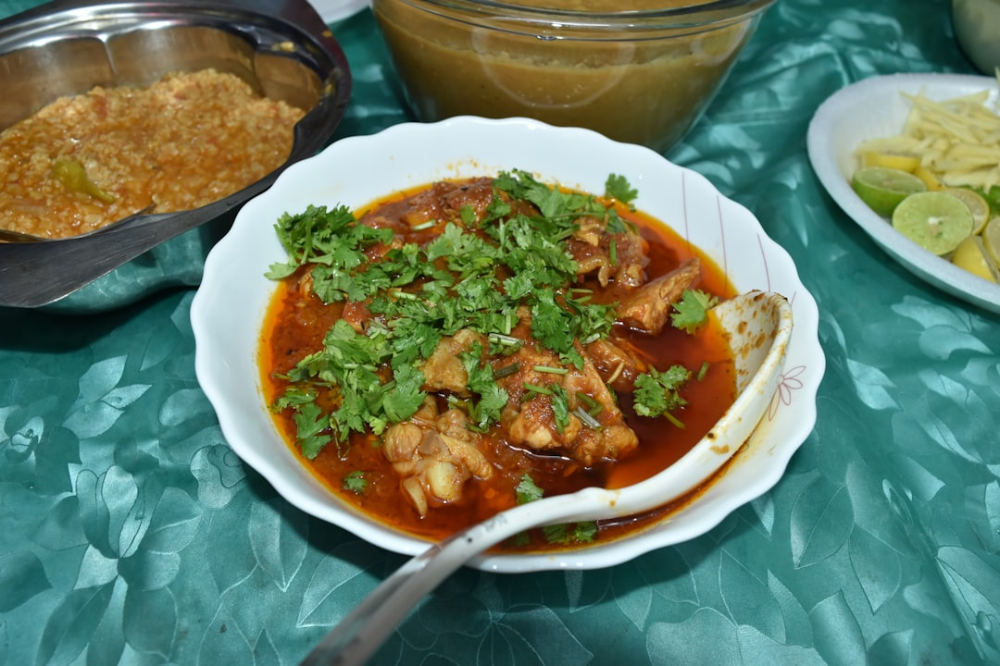

# Simple Lahori Chicken Curry

**Serves:** 4

## Overview
A traditional Lahori-style chicken curry built on a base of caramelised onions, tomatoes, and whole spices bloomed in oil. Yoghurt is added gradually to prevent splitting, creating a rich, silky sauce. Finished with fresh coriander and lemon juice, this is a deeply flavourful North Indian classic.

## Ingredients

### Chicken & Marinade
- 1 whole chicken (about 1.8 kg), cut into 8–10 pieces, skin removed
- ¾ tsp turmeric, divided
- ½ tsp cayenne pepper, divided
- Salt, to taste

### Sauce
- 1½ medium onions, roughly diced (about 225 g)
- 5 garlic cloves
- 5 cm fresh ginger, peeled and halved crosswise
- 45 ml canola oil, divided
- 5 cm cinnamon stick
- 12 green cardamom pods
- 9 whole cloves
- 9 black peppercorns
- 2 large tomatoes, chopped (about 300 g)
- 30 ml tomato paste
- 60 ml plain yogurt, whisked smooth
- 240 ml water

### To Finish
- 30 g fresh coriander, chopped
- Juice of 1 lemon (about 30 ml)

## Method

### Stage 1 – Marinate the Chicken
1. In a bowl, combine the chicken with ½ tsp turmeric, ½ tsp cayenne, and ½ tsp salt.
2. Mix well and set aside.

### Stage 2 – Prepare Aromatics
1. Finely mince the onions, garlic, and ginger in a food processor. Set aside.

### Stage 3 – Bloom the Spices
1. Heat 30 ml oil in a large casserole over medium-high heat.
2. Add the cinnamon stick, cardamom pods, cloves, and peppercorns.
3. Cook, stirring, until fragrant (1–2 minutes).

### Stage 4 – Cook the Onions
1. Add the minced onion mixture and 5 g salt.
2. Cook, stirring often, until onions brown around the edges (10–15 minutes).
3. Remove and discard the cinnamon stick.

### Stage 5 – Build the Sauce
1. Stir in the remaining ¼ tsp turmeric and ¼ tsp cayenne.
2. Add tomatoes and tomato paste; cook 5 minutes.
3. Blend until smooth and set aside.

### Stage 6 – Cook the Chicken
1. Heat the remaining 15 ml oil in the same pan over medium-high heat.
2. Add the chicken and cook, stirring, for 2 minutes.

### Stage 7 – Add Yogurt
1. Add yogurt 1 tablespoon at a time, stirring well after each addition.
2. Cook for 2 minutes to evaporate excess moisture.

### Stage 8 – Simmer
1. Add the blended tomato mixture and bring to a boil.
2. Stir in the water, return to a boil, then reduce heat.
3. Simmer partially covered until chicken is cooked through, about 30 minutes.
4. Stir and scrape the bottom every 5–8 minutes.

### Stage 9 – Finish
1. Uncover and cook 5 more minutes to thicken the sauce.
2. Stir in coriander and lemon juice.
3. Adjust salt to taste.

## Notes
- **Yogurt addition:** Add yogurt one tablespoon at a time to prevent the sauce from splitting; this is the key technique in Lahori cooking.
- **Blending:** Blending the tomato and onion mixture creates a smooth, restaurant-style sauce; skip for a more rustic texture.
- **Whole spices:** Remove the cinnamon stick before blending; the cardamom, cloves, and peppercorns will be blended into the sauce.
- **Colour:** The dish should be a deep, warm reddish-brown from the caramelised onions and tomatoes.

## Serving
Serve with: Steamed basmati rice, naan, or roti. Accompany with cucumber raita and pickled onions.
Garnish with: Fresh coriander and a wedge of lemon.

## Storage
- Keeps 3–4 days refrigerated in a sealed container
- Freezes well up to 2 months
- Reheat gently on the stovetop, adding a splash of water if the sauce thickens
