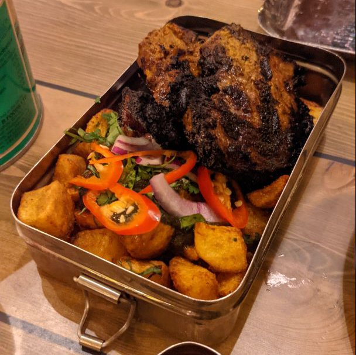

# Maa’s Lamb Chops

**Serves:** 4

**Prep Time:** 5 minutes

**Cook Time:** 10 minutes

## Overview
Tender lamb chops marinated in spiced yogurt, evoking the aroma of family parties. Despite poor margins, this dish captures the essence of home and Mowgli's heritage. Grilled to perfection for a nostalgic, flavorful experience.

## Ingredients
### Protein
- 8 lamb chops, about 2.5 cm (1 inch) thick

### Marinade
- 500 g (1 lb 2 oz/2 cups) plain yogurt
- 2 tbsp ground cumin
- 2 tbsp paprika
- 1 tsp ground cloves
- 1 tsp ground green cardamom
- 1 tsp fenugreek powder
- 1 tsp ground turmeric
- Juice of 1 lemon
- 4 garlic cloves, minced
- 1 tbsp minced fresh root ginger
- 2 tsp salt

## Method

### Stage 1 – Marinate chops
1. In large bowl, mix yogurt, cumin, paprika, cloves, cardamom, fenugreek, turmeric, lemon juice, garlic, ginger, and salt.
1. Add lamb chops; massage marinade in fully.
1. Cover and refrigerate at least 4 hours, preferably overnight.

### Stage 2 – Grill chops
1. Preheat grill/broiler to highest setting.
1. Place chops on baking sheet.
1. Grill/broil 3–4 mins per side for medium-rare.

### Stage 3 – Serve
1. Serve with Mowgli Slaw, Carrot Salad, and Rotis.

## Notes
- Marinate longer for deeper flavor.
- Adjust cooking time for desired doneness.
- Chops may stick to grill; oil if needed.

## Serving
- Serve with Mowgli Slaw, Carrot Salad, and fresh Rotis.
- Garnish with lemon wedges and cilantro.

## Storage
- Refrigerate marinated chops up to 24 hours.
- Cooked chops refrigerate 2 days.
- Reheat gently on grill or in oven.
- Freeze marinated uncooked chops up to 1 month.