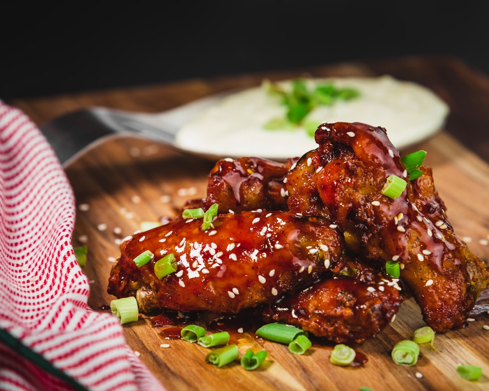

# Mowgli Sticky Wings

**Serves:** 4–6

**Prep Time:** 5 minutes

**Cook Time:** 45 minutes

## Overview
Crispy, sweet, and sticky chicken wings with a rich, fruity glaze from date syrup and treacle. These finger-licking wings blend dessert-like sweetness with savory spices, perfect for satisfying cravings at the intersection of sweet and savory.

## Ingredients
### Protein
- 1 kg (2 lb 3 oz) chicken wings

### Sweeteners
- 4 tbsp date syrup
- 2 tbsp black treacle (molasses)

### Aromatics
- 3 garlic cloves, minced
- 5 cm (2 inch) piece fresh root ginger, peeled and grated

### Spices
- 1 tsp garam masala
- 2 tsp ground cumin
- ½ tsp black mustard seeds

### Alcohol
- 4 tsp dark rum

### Acid
- Juice of ½ lemon
- 2 tbsp white wine vinegar

### Seasoning
- 1 tsp salt

## Method

### Stage 1 – Marinate wings
1. In large bowl, mix all ingredients except chicken wings.
1. Add chicken wings; cover and refrigerate at least 3 hours.

### Stage 2 – Roast wings
1. Preheat oven to 200°C (400°F/Gas 6).
1. Spread wings in even layer on large roasting pan.
1. Roast 40–45 mins, turning once, until cooked through, golden, and sticky.
1. Serve immediately.

## Notes
- Marinating enhances flavor; longer is better.
- Ensure wings are cooked through for safety.
- Adjust sweetness with more syrup if desired.

## Serving
- Serve hot as appetizer or main with rice.
- Garnish with sesame seeds or extra ginger.

## Storage
- Refrigerate cooked wings 2–3 days in airtight container.
- Reheat in oven at 180°C to maintain crispiness.
- Freeze marinated uncooked wings up to 1 month; thaw before roasting.