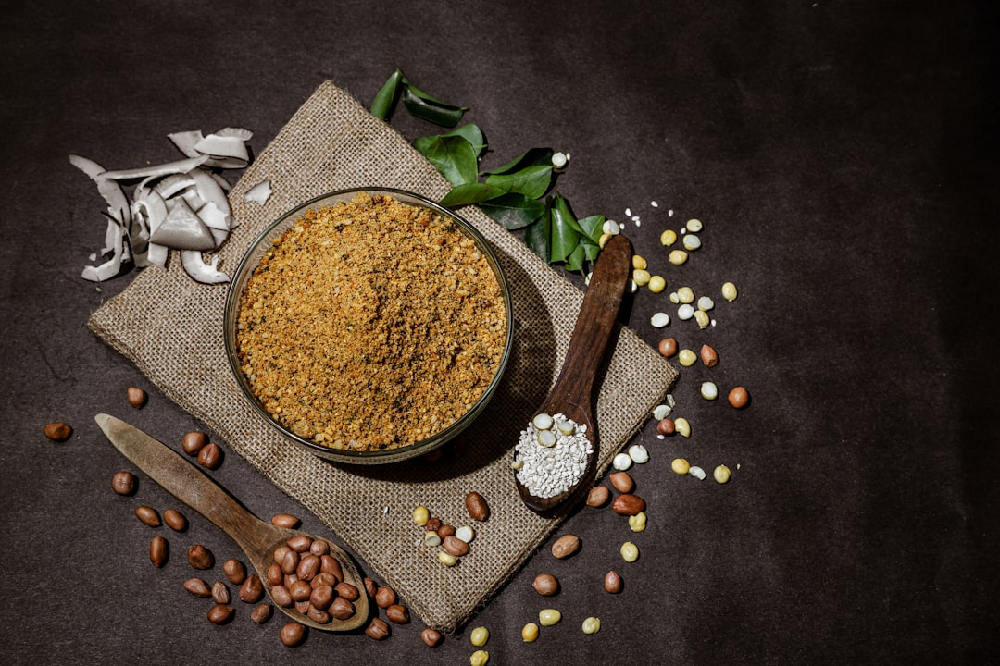

# Chole Masala Powder

## Overview
A unique Punjabi spice blend specifically designed for chole masala (chickpea curry). While this blend is generally only used for chole masala, making it homemade ensures authentic flavour. Ready-made versions are available at many Asian grocers and online if you prefer convenience, but homemade is worth the effort.

**Makes:** Approximately 250ml
**Prep Time:** 5 minutes
**Cook Time:** 3 minutes

## Ingredients
- 3 tbsp cumin seeds
- 3 tbsp coriander seeds
- 3 tbsp dried pomegranate seeds
- 3–4 dried red chillies
- 2 tsp ajwain (carom) seeds
- 2 tbsp dried fenugreek leaves (kasoori methi)
- 8–10 green cardamom pods, lightly bruised
- 1 tsp black peppercorns
- 5cm (2in) piece of cinnamon stick or cassia bark
- 8 cloves
- 1 tsp dried ginger powder
- 1 tsp amchoor (dried mango powder)

## Method

### Stage 1 – Roast First Batch
1. Heat a dry frying pan over medium–high heat.
2. Add cumin seeds and coriander seeds together and toast until warm to the touch and fragrant (about 2 minutes).
3. Be careful not to smoke or burn them.
4. Transfer to a bowl to cool.

### Stage 2 – Roast Second Batch
1. Add dried pomegranate seeds, chillies, ajwain seeds, fenugreek leaves, cardamom pods, peppercorns, cinnamon, and cloves to the same pan.
2. Toast lightly for about 1 minute until fragrant but not smoking.
3. Transfer to the bowl with the first batch and leave to cool completely.

### Stage 3 – Grind & Store
1. Place the cooled spices in a spice grinder with ginger powder and amchoor.
2. Grind to a fine powder.
3. Store in an airtight container.

## Notes
- **Pomegranate seeds:** These add a distinctive tangy note that's essential to chole masala.
- **Two-stage roasting:** Roasting spices in two batches ensures even cooking and prevents burning of delicate spices like fenugreek.
- **Ready-made option:** Available at Asian grocers if you prefer convenience, but homemade is superior in flavour.

## Storage
- Store in an airtight container in a cool, dark place
- Use within 3 months for optimal flavour
- Makes a generous batch, keep extra on hand for when you crave chole masala