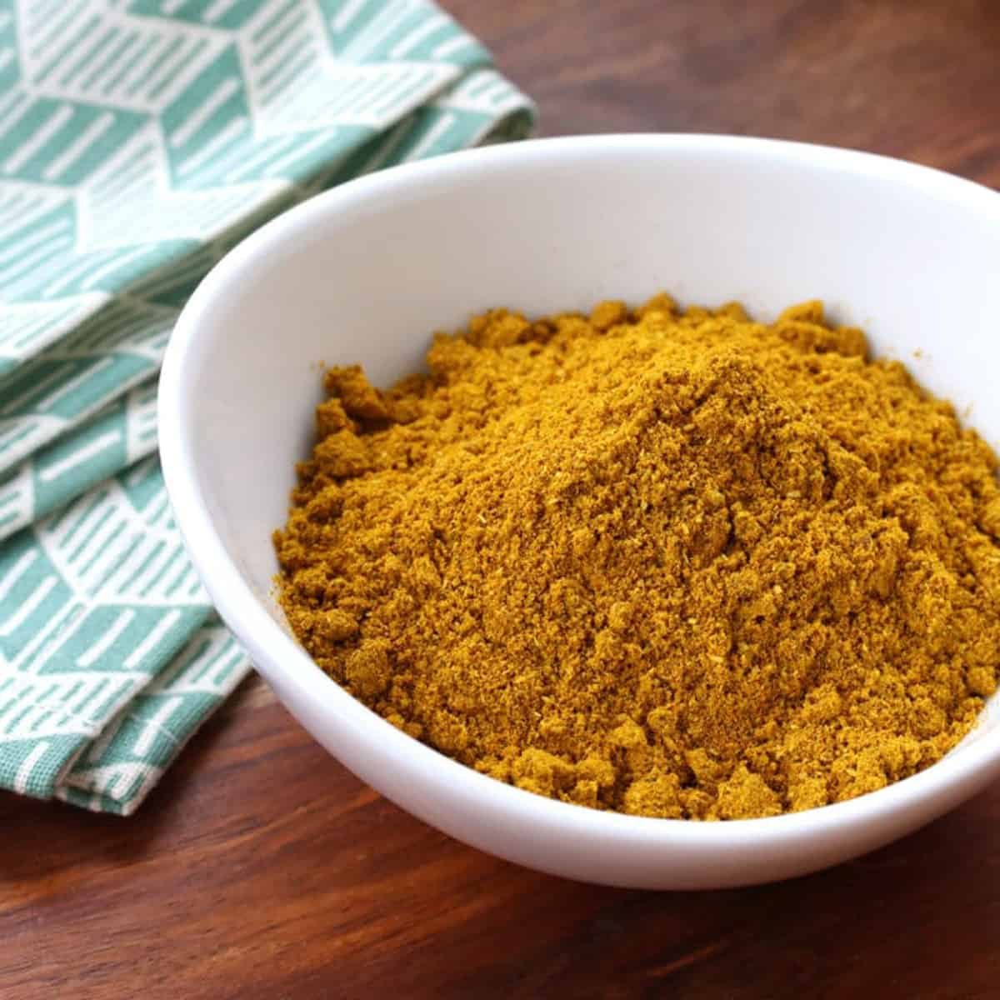

# Curry Powder

## Overview
Commercially prepared curry powders date back to the 18th century, when Indian merchants prepared spice blends for British army and government officials returning to Britain during the British Raj. Unlike garam masalas (warming spices), curry powders contain complementary ingredients with chillies added for spiciness. This version is moderately spiced but can be adjusted to your preference by omitting or reducing dried chillies and chilli powder.

**Makes:** 285g (2½ cups)
**Prep Time:** 8 minutes
**Cook Time:** 2 minutes

## Ingredients
- 6 tbsp coriander seeds
- 6 tbsp cumin seeds
- 4 tbsp black peppercorns
- 2 tbsp fennel seeds
- 2 tbsp black mustard seeds
- 12cm (5in) piece of cinnamon stick or cassia bark
- 4 Indian bay leaves (cassia leaves)
- 3 tbsp fenugreek seeds
- 3 star anise
- 15 cardamom pods, lightly bruised
- 8 Kashmiri dried red chillies (optional)
- 2 tbsp ground turmeric
- 2 tbsp hot chilli powder (optional)
- 1 tsp garlic powder
- 2 tsp dried onion powder

## Method

### Stage 1 – Roast Whole Spices
1. Roast all the whole spices, including dried chillies (if using), in a dry frying pan over medium–high heat until warm to the touch and fragrant but not smoking.
2. Move the spices around in the pan so they roast evenly.
3. Be careful not to burn them or they will become bitter.

### Stage 2 – Cool & Grind
1. Tip the warm spices onto a plate and leave to cool completely.
2. Grind to a fine powder in a spice grinder or pestle and mortar.

### Stage 3 – Mix Ground Spices
1. Add turmeric, chilli powder (if using), garlic powder, and onion powder to the ground spices.
2. Stir thoroughly to combine.

## Notes
- **Heat level:** This blend is moderately spiced. Adjust by omitting or reducing Kashmiri chillies and chilli powder to suit your preference.
- **Roasting tip:** Even roasting prevents bitter flavours, move spices constantly and remove from heat if smoking begins.
- **Restarting:** If you accidentally burn the spices, discard and start again rather than compromising the batch.
- **Historical note:** A staple of British curry houses and essential to recreating authentic BIR flavours.

## Storage
- Store in an airtight container in a cool, dark place
- Use within 2 months for optimal flavour