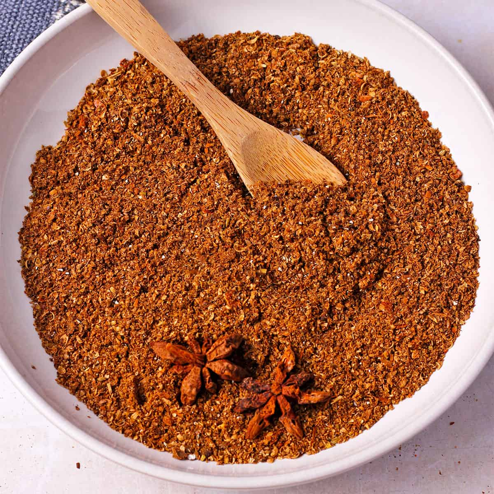

# Garam Masala

## Overview
A blend of warming, aromatic spices essential to Indian cooking. In India, the ingredients used can vary greatly from region to region and even from family to family. This version uses the same spices popular in northern India, Bangladesh and Pakistan, essential for achieving that curry-house flavour. Garam masala is an important part of mixed powder used in most BIR curries, and is also added on its own to many recipes.

**Makes:** 170g (1½ cups)
**Prep Time:** 8 minutes
**Cook Time:** 2 minutes

## Ingredients
- 6 tbsp coriander seeds
- 6 tbsp cumin seeds
- 5 tsp black peppercorns
- 4 tbsp fennel seeds
- 3 tsp cloves
- 7.5cm (3in) piece of cinnamon stick or cassia bark
- 5 dried Indian bay leaves (cassia leaves)
- 20 green cardamom pods, lightly bruised
- 2 large pieces of mace

## Method

### Stage 1 – Roast
1. Roast all the spices in a dry frying pan over medium–high heat until warm to the touch and fragrant.
2. Move them around in the pan as they roast, being careful not to burn them.
3. If they begin to smoke, remove from heat immediately.

### Stage 2 – Cool & Grind
1. Tip the warm spices onto a plate and leave to cool completely.
2. Grind to a fine powder in a spice grinder or pestle and mortar.

## Notes
- **Finishing touch:** Sprinkle over finished curries to add extra flavour and excitement.
- **Roasting tip:** Roasting just before grinding maximizes freshness and aroma.
- **Heat level:** This blend is warming and aromatic, not spicy.

## Storage
- Store in an airtight container in a cool, dark place
- Use within 2 months for optimal flavour