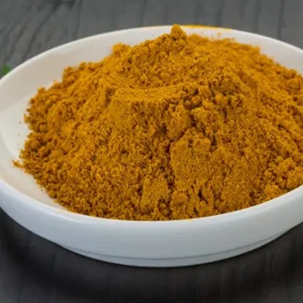

# Mixed Powder

## Overview
A curry house-style spice blend and one of the secret ingredients that makes BIR curries what they are. Mixed powder combines the flavours of cumin, coriander, paprika, and turmeric, spices essential to most BIR curries. You will use it in almost all classic curries. This blend makes it possible to add multiple spices in one go, along with curry powder and garam masala, for consistent and efficient seasoning.

**Makes:** 17 generous tablespoons
**Prep Time:** 5 minutes
**Cook Time:** 0 minutes

## Ingredients
- Homemade garam masala (see Garam Masala recipe)
- Homemade curry powder (see Curry Powder recipe)
- Additional ground coriander, cumin, paprika, and turmeric (quantities adjusted to taste)

## Method

### Stage 1 – Combine
1. Mix all the ingredients together thoroughly.
2. Store in an airtight container in a cool, dark place.

## Notes
- **Key ingredient:** This is essential to BIR curry-making, don't skip it.
- **Customization:** You can adjust flavour by adding a little more of individual spices or masalas to taste.
- **Quick alternative:** If homemade is too time-consuming, use a good-quality store-bought curry powder instead.
- **Consistency:** Using fresh, homemade garam masala and curry powder ensures the best flavour development.

## Storage
- Store in an airtight container in a cool, dark place
- If using fresh homemade garam masala and curry powder: use within 2 months
- If using store-bought components: check individual package dates for guidance