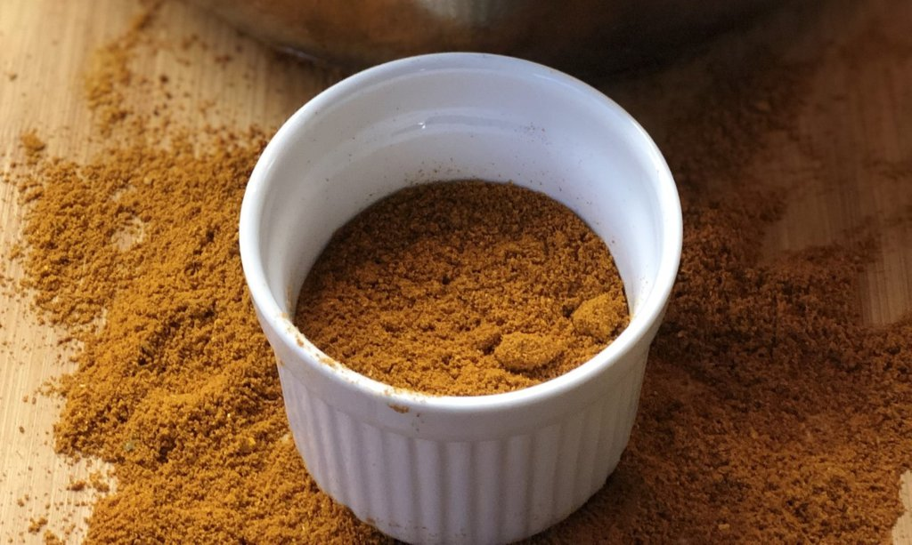

# Mixed Powder

**Makes:** 17 tbsp

**Prep Time:** 5 minutes

## Overview
Classic British Indian Restaurant (B.I.R.) curry powder used for most classic curries. Provides the signature B.I.R. flavor; can be made with commercial or homemade curry powder and garam masala.

## Ingredients
### Ground spices
- 3 tbsp ground cumin
- 3 tbsp ground coriander
- 4 tbsp curry powder
- 3 tbsp paprika
- 3 tbsp ground turmeric
- 1 tbsp garam masala

## Method

### Stage 1 – Mix ingredients
1. Combine all ingredients in a bowl.
1. Mix thoroughly until well blended.

### Stage 2 – Store
1. Store in an airtight container.

## Notes
- High yield recipe; lasts up to 4 months.
- For smaller batches, use parts instead of tbsp.
- Use in B.I.R. curries for authentic taste.

## Serving
- Not served directly; used as spice base in curries.

## Storage
- Store in airtight container in cool, dark place up to 4 months.
- Keep away from moisture and heat.
